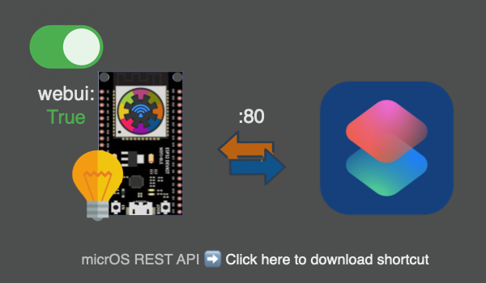
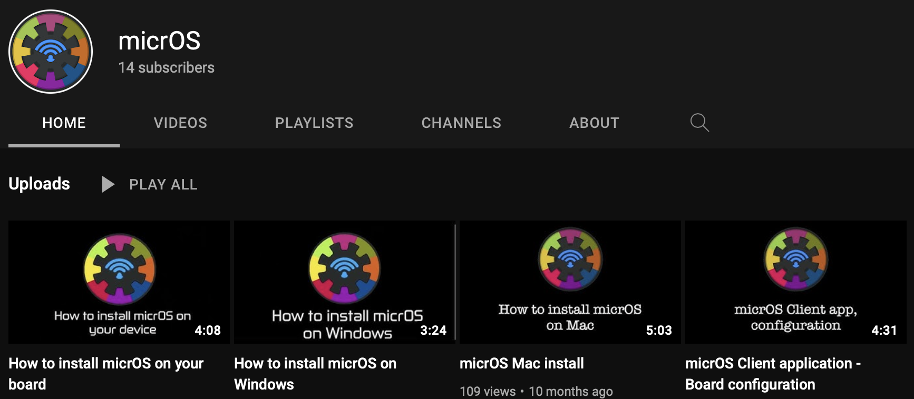
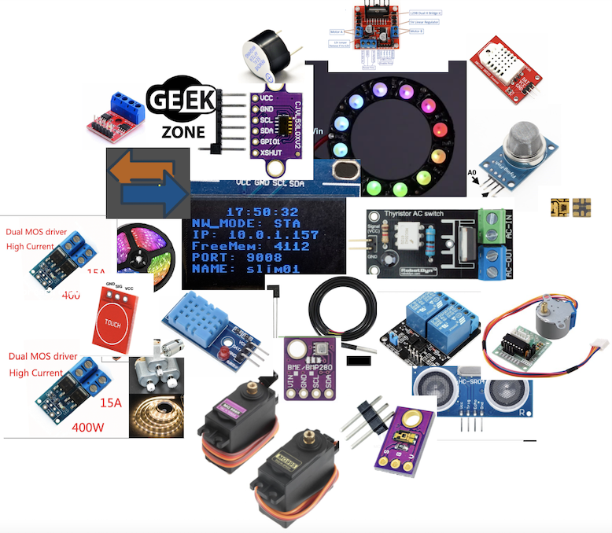

#  micrOS


### micropython based smart edge platform #IoT

                 <br/>


Thanks for , follow us on:

[](https://www.instagram.com/micros_framework/)
[](https://www.youtube.com/channel/UChRlJw7OYAoKroC-Mi75joA)
[](https://www.facebook.com/Micros-Framework-103501302140755)
[](https://www.thingiverse.com/micros_framework/designs)
[](https://hub.docker.com/r/bxnxm/micros-gateway)<br/>

[](https://pypi.org/project/micrOSDevToolKit/)


**micrOS** is a mini **application** execution **platform** with ShellCli (socket) and webCli (http) **servers** and several **other** embedded **features**.
> It uses direct wifi connection to access the exposed functionalities.<br/>

In case of any technical comments or requests, please use [](https://github.com/BxNxM/micrOS/discussions).


[](https://www.icloud.com/shortcuts/898c2a8033d64ff0b7aadc46ee491a35)<br/>
Example shortcut (usage of the API): [link](https://www.icloud.com/shortcuts/fab936abb34b45b5bda4c9f7abb256e9)<br/>
Access rest api over browser: `http://<nodename>.local`

----------------------------------------
----------------------------------------

📲 💻 ShellCli: Generic session-based communication API <br/>
📲 WebCli: Apple shortcuts compatible **REST API** and **http homepage** <br/>
&nbsp;&nbsp; ✉️ Expose upython module functions - telnet **TCP/IP** and **REST API** <br/>
⚙️ 📝 Device initialization from user config <br/>
🧩  Codeless end user experience via phone client <br/>
⚠️  No external server or service required for client-device communication <br/>
&nbsp;&nbsp; ⚠️ 🛡 Works on Local Network (WiFi-WLAN) <br/>
🛠 Easy to customize, create your own Load Modules: <br/>
&nbsp;&nbsp; 1. Write **LM_**`<your_app>`**.py** <br/>
&nbsp;&nbsp; 2. Copy (OTA/USB) python script to your device (drap&drop)<br/>
&nbsp;&nbsp; 3. Call any function from **`<your_app>`** module <br/>
🦾 Built-in scheduling (IRQs):<br/>
&nbsp;&nbsp; - Time stamp based <br/>
&nbsp;&nbsp; - Geolocation based utc + sunset, sunrise rest features <br/>
&nbsp;&nbsp; - Simple periodic <br/>
🔄 Async **task manager** - start (&/&&) / list / kill / show <br/>

🚀🎈Lightweight and high performance core system that leaves you space 😎

## ◉ Shortcuts:
1. micrOS Client Application [link](https://github.com/BxNxM/micrOS#micrOS-Client-Application)
2. micrOS Installer [link](https://github.com/BxNxM/micrOS/#installing-micros-with-devtoolkit-esp32)
3. micrOS Tutorials [link](https://github.com/BxNxM/micrOS#micros-video-tutorials)
4. micrOS System and features [link](https://github.com/BxNxM/micrOS#micros-system-message-function-visualization)
5. Pin mapping - GPIO [link](https://github.com/BxNxM/micrOS#built-in-periphery-support)
6. micrOS Node configuration [link](https://github.com/BxNxM/micrOS#micros-node-configuration-parameters-with-description)
7. micrOS customization with LMs: [link](https://github.com/BxNxM/micrOS#micros-customization)
8. micrOS gateway with Prometheus&Grafana: [link](https://github.com/BxNxM/micrOS#micros-gateway-in-docker)
9. Release notes: [link](https://github.com/BxNxM/micrOS#RELESE-NOTE)

----------------------------------------
----------------------------------------

## micrOS Client Application

[](https://apps.apple.com/hu/app/micros-client/id1562342296) &nbsp;&nbsp;&nbsp;&nbsp;&nbsp;&nbsp;&nbsp; [](https://play.google.com/store/apps/details?id=com.BMT.micrOSClient)

----------------------------------------
----------------------------------------

## Installing micrOS with DevToolKit #ESP32 and more
**macOS / Windows / Linux to install any esp32 board**

[](https://pypi.org/project/micrOSDevToolKit/)

End-to-End solution for deployment, update, monitor and develop micrOS boards.

I would suggest to use micrOS GUI as a primary interface for micrOS development kit, but you can use cli as well if you prefer.

> Note: The main purpose of the USB deployment scripts to install micropython on the board and put all micrOS resources from `micrOs/toolkit/workspace/precompiled` to the connected board.

<br/>

### 1. Install python3.9

Link for python 3.9 [download](https://www.python.org/downloads/release/python-390/)

> Note: **Allow extend system path** with that python version (installation parameter) </br>
> On **Windows**: RUN AS ADMINISTARTOR

----------------------------------------

### 2. Install micrOS/Linux devToolKit GUI

#### On macOS/Linux

&nbsp;Open **command line** on mac, press: `commnd+space` + type: `terminal` + press: `enter`

##### Download and install **micrOS devToolKit** python package:

```bash
pip3 install --upgrade pip; pip3 install micrOSDevToolKit
```

> Later on you can **update** the package with

```bash
pip3 install --upgrade micrOSDevToolKit
```

----------------------------------------
<br/>

#### On Windows:

##### Download and install **micrOS devToolKit** python package:

Open Windows **PowerShell**, press `windows+R` + type: `powershell` + press `enter`

Copy the following lines to the PowerShell and press enter.

```bash
python -m pip install --upgrade pip
python -m pip install micrOSDevToolKit
```

Later on you can **update** the package with

```bash
python -m pip install --upgrade micrOSDevToolKit
```

----------------------------------------
<br/>

### 3. Start micrOS devToolKit GUI

Copy the following command to the command line and press enter to start.

**```devToolKit.py```**

It will open a graphical user interface for micrOS device management, like usb deploy, update, OTA operations, test executions, etc...

----------------------------------------


- Example

```
1. Select BOARD TYPE
2. Click on [Deploy (USB)] button -> presss YES
```

It will install your board via USB with default settings. **Continue with micrOS Client app...**

> Note: At the first USB deployment, devToolKit will ask to install **SerialUSB driver** and it will open the driver installer as well, please follow the steps and install the necessary driver.


```
╔╗ ╔╗                  ╔═══╗╔╗ ╔╗╔═╗ ╔╗       ╔═══╗
║║ ║║                  ║╔══╝║║ ║║║║╚╗║║       ╚╗╔╗║
║╚═╝║╔══╗ ╔╗╔╗╔══╗     ║╚══╗║║ ║║║╔╗╚╝║    ╔═╗ ║║║║
║╔═╗║╚ ╗║ ║╚╝║║╔╗║     ║╔══╝║║ ║║║║╚╗║║    ╚═╝ ║║║║
║║ ║║║╚╝╚╗╚╗╔╝║║═╣    ╔╝╚╗  ║╚═╝║║║ ║║║    ╔═╗╔╝╚╝║
╚╝ ╚╝╚═══╝ ╚╝ ╚══╝    ╚══╝  ╚═══╝╚╝ ╚═╝    ╚═╝╚═══╝
```

----------------------------------------

## micrOS Projects


[](https://youtu.be/BlQzAnFtpLk)


----------------------------------------
----------------------------------------


## micrOS Video Tutorials

[](https://www.youtube.com/channel/UChRlJw7OYAoKroC-Mi75joA)

----------------------------------------
<br/>

## micrOS System, message-function visualization


>Note: micrOS development kit contains command line interface for socket communication. Example: `devToolKit.py --connect`

----------------------------------------

## micrOS Framework Features💡


- 🕯**micrOS loader** - starts micrOS or WEBREPL(update / recovery modes)
	- **OTA update** - push update over wifi (webrepl automation) / monitor update and auto restart node
- 📄**Config handling** - user config - **node_config.json**
    - ⏳**Boot phase** - preload Load Module(s)
        - For pinout and last state initialization - based on node_config `boothook`
        - Example values: `rgb load_n_init; neopixel load_n_init`
    - 📡**Network handling** - based on node_config 
        - STA / AP network modes, `nwmd`
        - NTP + UTC aka clock setup
          - API: [ip-api.com](http://ip-api.com/json/?fields=lat,lon,timezone,offset)
        - Static IP configuration, `devip`
        - dhcp hostname setup, `devfid`.local
    - ⚙️**Scheduling / External events** - Interrupt callback - based on node_config 
        - Time based
            - ⌛️simple LM task pool execution `timirq` & `timirqcbf`
                - `Timer(0)`
            - 🗓cron [time stump!LM task] pool execution `cron` & `crontasks`
                - `Timer(1)` 
                - timestamp: `WD:H:M:S!LM FUNC`, ranges: `0-6:0-23:0-59:0-59!LM FUNC`
                    - example: `*:8:0:0!rgb rgb r=10 g=60 b=100; etc.`, it will set rgb color on analog rgb periphery at 8am every day.
                    - `WD: 0...6` 0=Monday, 6=Sunday -> optional range handling: 0-2 means Monday to Wednesday
                - tag: `sunset` / `sunrise`
                    - example: `sunset!rgb rgb r=10 g=60 b=100; etc.`, it will set rgb color on analog rgb periphery at every sunset, every day.
                    - optional minute offset (+/-): sunrise+30

                - API: [api.sunrise-sunset.org](https://api.sunrise-sunset.org/json?lat={lat}&lng={lon}&date=today&formatted=0)
        - 💣Event based
            - Set trigger event `irqX`
                - Trigger up/down/both `irqX_trig`
                - With LM callback function `irqX_cbf`
            - X = 1, 2, 3 or 4

- ⚙️**[L]oad [M]odule** aka **application** handling
	- Lot of built-in functions (table below)
	- Create your own module with 3 easy steps
		- Create a python file, naming convention: `LM_<your_app_name>.py`
			- Replace `<your_app_name>` for anything you prefer!
		- Write python functions, you can call any function from that module...
		- Upload modul with "drag&Drop" with help of devToolKit GUI `devToolKit.py`

- 📨**ShellCli** - wireless communication interface with the nodes
	- **System commands**: `help, version, reboot, webrepl, webrepl --update, etc.`
		- After `webrepl --update` command the micrOS system reboots and waits for ota update in webrepl mode.
	- **Config handling** SET/GET/DUMP - **node_config.json**
		- enter configuration mode: `conf`
		- exit configuration mode:`noconf`
		- Print out all parameters and values: `dump`
	- **LM** - Load Module function execution (application modules)
		- Example: `system info`
- 🖇**Logical IO** pinout handling - lookuptables for each board
	- Predefined pinout modules for esp32, tinyPico
	- Create your pinout based on `IO_esp32.py`, naming convencion: `IO_<name>.py`
	- To activate your custom pinout set `cstmpmap` config parameter to `<name>`

- 🔄 **Task manager** aka **Async LM jobs**
	- Capable of execute [L]oad [M]odules in the background 
	- Invoke with single execution `&` or loop execution `&&`
	- Example:
		- In loop: `system heartbeat &&`
			- Loop frequency conrol: `system heartbeat &&1000`, it will execute every sec 
		- Single call: `system heartbeat &`
			- Delayed execution (ms): `system heartbeat &1000`, waits 1 sec before execution.
	- Stop task: `task kill system.heartbeat`
	- Show task live ouput: `task show system.heartbeat`


⌘ DevToolKit CLI feature:

- Socket client python plugin - interactive - non interactive mode


## Built in periphery support

`#Sensors / inputes` `#Actuators / outputs`

[](https://htmlpreview.github.io/?https://github.com/BxNxM/micrOS/blob/master/micrOS/client/sfuncman/sfuncman.html)

[[CLICK] Show micrOS Load Module functions](https://htmlpreview.github.io/?https://github.com/BxNxM/micrOS/blob/master/micrOS/client/sfuncman/sfuncman.html)</br>

----------------------------------------

## Device Pinouts for wiring

### Logical pin association handling

[micrOS/source/microIO.py](./micrOS/source/microIO.py)

LogicalPin lookup tables:

- [tinypico](./micrOS/source/IO_tinypico.py)
- [esp32](./micrOS/source/IO_esp32.py)
- [esp32s2](./micrOS/source/IO_esp32s2.py)
- [esp32s3](./micrOS/source/IO_esp32s3.py)
- [raspberryPicoW](./micrOS/source/IO_rp2.py) - reset needed after ota update (webrepl limitation)

> Note: Good idea to use costant variable for pin map declaration, check the files for more info, These files are also precompiled automatically into byte steams -> `.mpy`


GENERAL CONTROLLER CONCEPT: [microPLC](./media/microPLC.png)


----------------------------------------

## micrOS **node configuration**, parameters with description

These parameters controlls micrOS core functionalities, so you can define an entire system by setting your custom configurations via these values.

### Basic parameters:

|      Config keys    |   Default value and type    | Reboot required |              Description                     |
| :-----------------: | :-------------------------: | :-------------: | ----------------------------------------- |
|   **`devfid`**      |    `node01`  `<str>`        |       Yes       | Device friendly "unique" ID - (1) defines AccessPoint (AP) network name and (2) in Station (STA) network mode the DHCP device name for IP address resolve also (3) this is the ShellCli prompt.
|   **`staessid`**    |   `your_wifi_name` `<str>`  |       Yes       | Wifi router name to connect (for STA default connection mode)
|   **`stapwd`**      | `your_wifi_passwd` `<str>`  |       Yes       | Wifi router password (for STA default connection mode)
|   **`appwd`**       |   `ADmin123`  `<str>`       |       Yes       | Device system password.: Used in AP password (access point mode) + webrepl password + micrOS auth
| **`boothook`**      |    `n/a` `<str>`            |      Yes        | Add Load Module execution(s) to the boot sequence. Separator `;`. Examples: `rgb load_n_init; cct load_n_init` but you can call any load module function here if you want to run it at boot time.
| **`webui`**         |       `False`  `bool`       |      Yes        | Launch http rest server on port 80 (in parallel with micrOS shell on port 9008 aka `socport`). It has 2 endpoints: / aka main page (index.html) and /rest aka rest (json) interface for load module execution. Example: `<devfid>.local` or `<devfid>.local/rest` + optional parameters: `/rgb/toggle`. **Apple shortcuts compatible**
| | |
| **`cron`**          |     `False`  `<bool>`       |       Yes       | Enable timestamp based Load Module execution aka Cron scheduler (linux terminology), Timer(1) hardware interrupt enabler.
| **`crontasks`**     |     `n/a`  `<str>`          |       Yes       | Cron scheduler input, task format: `WD:H:M:S!module function` e.g.: `1:8:0:0!system heartbeat`, task separator in case of multiple tasks: `;`. [WD:0-6, H:0-23, M:0-59, S:0-59] in case of each use: `*`. Instead `WD:H:M:S` you can use suntime tags: `sunset`, `sunrise`, optional offset: `sunset+-<minutes>`, `sunrise+-<minutes>`, example: `sunset-30!system heartbeat`. Range of days: WD can be conrete day number or range like: 0-2 means Monday to Wednesday.
| | |
| **`irq1`**          |     `False`  `<bool>`       |      Yes        | External event interrupt enabler - Triggers when desired signal state detected - button press happens / motion detection / etc.
| **`irq1_cbf`**      |     `n/a`  `<str>`          |      Yes        | `irq1` enabled, calls the given Load Modules, e.x.: `module function optional_parameter(s)` when external trigger happens.
| **`irq1_trig`**     |     `n/a`   `<str>`         |      Yes        | Sets trigger mode for external irq, signal phase detection, values `up` (default: `n/a`) or `down` or `both`.
| **`irq2`**          |     `False`  `<bool>`       |      Yes        | External event interrupt enabler - Triggers when desired signal state detected - button press happens / motion detection / etc.
| **`irq2_cb`f**      |     `n/a`  `<str>`          |      Yes        | `irq2` enabled, calls the given Load Modules, e.x.: `module function optional_parameter(s)` when external trigger happens.
| **`irq2_trig`**     |     `n/a`   `<str>`         |      Yes        | Sets trigger mode for external irq, signal phase detection, values `up` (default: `n/a`) or `down` or `both`.
| **`irq3`**          |     `False`  `<bool>`       |      Yes        | External event interrupt enabler - Triggers when desired signal state detected - button press happens / motion detection / etc.
| **`irq3_cbf`**      |     `n/a`  `<str>`          |      Yes        | `irq3` enabled, calls the given Load Modules, e.x.: `module function optional_parameter(s)` when external trigger happens.
| **`irq3_trig`**     |     `n/a`   `<str>`         |      Yes        | Sets trigger mode for external irq, signal phase detection, values `up` (default: `n/a`) or `down` or `both`.
| **`irq4`**          |     `False`  `<bool>`       |      Yes        | External event interrupt enabler - Triggers when desired signal state detected - button press happens / motion detection / etc.
| **`irq4_cbf`**      |     `n/a`  `<str>`          |      Yes        | `irq4` enabled, calls the given Load Modules, e.x.: `module function optional_parameter(s)` when external trigger happens.
| **`irq4_trig`**     |     `n/a`   `<str>`         |      Yes        | Sets trigger mode for external irq, signal phase detection, values `up` (default: `n/a`) or `down` or `both`.
| **`irq_prell_ms`**  |      `300`   `<int>`        |      Yes        | "Prell": contact recurrence (hw property), for fake event filtering... :D Time window to ignore external IRQ events in ms.
| | |
| **`timirq`**        |     `False`  `<bool>`       |       Yes       | Timer(0) interrupt enabler - background "subprocess" like execution, timer based infinite loop for the LoadModule execution.
| **`timirqcbf`**     |      `n/a`   `<str>`        |      Yes        | if `timirq` enabled, calls the given Load Module(s), e.x.: `module function optional_parameter(s)`, task separator: `;`
| **`timirqseq`**     |    `1000`   `<int>`         |      Yes        | Timer interrupt period in ms, default: `3000` ms (for `timirq` infinite loop timer value)
| | |
| **`telegram`**      |      `n/a`  `str`           |      No          | `TELEGRAM_BOT_TOKEN` to enable micrOS Notifications. **Hint**, to create bot with botfather: [click](https://blog.devgenius.io/how-to-set-up-your-telegram-bot-using-botfather-fd1896d68c02). After enabling this, send `/ping` to telegram chat for chat ID sync.

### Advanced parameter options:

|       Config keys   |   Default value and type    | Reboot required |               Description                      |
| :-----------------: | :-------------------------: | :-------------: | ---------------------------------------- |
| **`utc`**           |     `60`   `<int>`          |       Yes       | NTP-RTC - timezone setup (UTC in minute) - it is automatically calibrated in STA mode based on geolocation.
| **`cstmpmap`**      |      `n/a`  `<str>`          |      Yes       | Default (`n/a`), select pinmap automatically based on platform (`IO_<platform>`). Manual control / customization of application pins, syntax: `pin_map_name; pin_name:pin_number; ` etc. [1][optional] `pin_map_name` represented as `IO_<pin_map_name>.py/.mpy` file on device. [2+][optinal] `dht:22` overwrite individual existing load module pin(s). Hint: `<module> pinmap()` to get app pins, example: `neopixel pinmap()`
| **`boostmd`**       |      `True`  `<bool>`       |      Yes        | boost mode - set up cpu frequency low or high 16Mhz-24MHz (depends on the board).
| **`aioqueue`**      |    `3` `<int>`              |       Yes       | System async queue controller (resource limiter).: `#1` Set asyc task queue limit (for soft tasks: `&`). Furthermore `#2` Socker server-s (webCli, ShellCli) client number limiter. 3 means: 3 cooperative connection (queue) shared by webCli and shellCli. It can be increased based on available resources.
| | |
| **`devip`**         |      `n/a`  `<str>`         |    Yes(N/A)      | Device IP address, (first stored IP in STA mode will be the device static IP on the network), you can set specific static IP address here.
| **`nwmd`**          |     `n/a`  `<str>`          |      Yes        | Prefered network mode - `AP` or `STA`, default is `STA`.
| **`soctout`**       |   `30`      `<int>`         |      Yes        | Socket server connection timeout. If user is passive for `soctout` sec, and new connection incoming, then close passive connection. So it is time limit per connection in the `aioqueue`.
| **`socport`**       |    `9008`  `<int>`          |      Yes        | Socket server service port (should not be changed due to client and API inconpatibility).
| **`auth`**          |     `False` `<bool>`        |       Yes       | Enables socket password authentication, password: `appwd`. Passwordless functions: `hello`, `version`, `exit`. **WARNING** OTA upade not supported in this mode (yet).
| | |
| **`dbg`**	         |     `True`    `<bool>`      |       Yes       | Debug mode - enable micrOS system printout, server info, etc. + progress LED.
| **`hwuid`**         |      `n/a`  `<str>`         |      N/A        | USED BY SYSTEM (state storage) - hardware address - dev uid
| **`guimeta`**       |      `n/a`  `str`           |      No         | USED BY micrOS Client (state storage) - stores - offloaded parameter type in config. Clinet widget meta data storage.

> Note: Default empty value: `n/a` in case of string parameter.
> Note: Cron is only available on devices with Timer(**1**): esp32

----------------------------------------
----------------------------------------

# Networking - automatic network modes


# micrOS Gateway in docker


With prometheus database.
Check the micrOS Gateway docker [README](./env/docker/README.md) for details.

Resources:

> modify `prometheus.yml` regarding what sensors on which endpoint do you want to scrapre data from.

* [docker-compose](./env/docker/docker-compose.yaml)
* [prometheus config](./env/docker/prometheus.yml)

```bash
cd ./env/docker
docker-compose -p gateway up -d
```

Official [DockerHub](https://hub.docker.com/repository/docker/bxnxm/micros-gateway/general)

# micrOS Customization

Aka How to write Load Modules

1. Create python file with the following naming convension: `LM_`your_app`.py`
2. You can create any function in this modul, these will be exposed by micrOS framework over tcp/ip so these can be accessable via phone client.
3. drag-n-drop LM file to micrOS devToolKit GUI
4. Select device
5. Press upload

### LM\_simple.py

```python
def hello(name="Anonymous"):
	return f"Hello {name}!"


def add_two_numbers(a, b):
	return f"{a}+{b} = {a+b}"
```

### LM\_simple\_led.py

```python
from machine import Pin					# Import micropython Pin module

PIN = None								# Cache created Pin instance

def load_n_init():
	global PIN
	if PIN is None:
		PIN = Pin(4, Pin.OUT)			# Init PIN 4 as OUTPUT and store (cache) in global var.
	return PIN


def on():
	pin = load_n_init()
	pin.value(1)							# Set pin high - LED ON
	return "LED ON"


def off():
	pin = load_n_init()
	pin.value(0)							# Set pin low - LED OFF
	return "LED OFF"


def toggle():
	pin = load_n_init()
	pin.value(not pin.value())
	return "LED ON" if pin.value() else "LED OFF"
	
def help():
	return 'load_n_init', 'on', 'off', 'toggle'
```

For more info: Micropython official [Pins](https://docs.micropython.org/en/latest/library/machine.Pin.html)


### LM_template.py

Function naming convesions for Load Modules.

```python

from LogicalPins import physical_pin, pinmap_dump
from machine import Pin

def load_n_init():
	"""
	[RECOMMENDED]
	Function naming convension to create IO (Pin) objects
	- function to initialize IO peripheries

	physical_pin - to resolve pin on board by logical name (tag)
	"""
	
	pin_number = physical_pin('redgb')	# select pin number from platfrom lookup table
	red = Pin(pin_number)
	return red


def lmdep():
   """
   [OPTIONAL] [IN CASE OF LM DEPENDENCY]
   Function to return Load Module dependencies (tuple)
   - example: if this module uses LM_rgb.py, you should
   				 return 'rgb'
   """
	return '<module_name>'


def pinmap():
	"""
	[OPTIONAL]
	Return list of pins
	Example:
		RoboArm $  rgb pinmap >json
		{"rgbue": 15, "rgreenb": 12, "redgb": 14}
	return: dict {pinkey: pinvalue}
	
	pinmap_dump - logical pinmap resolver based on IO_<device_tag>.py
	
	Example:
	return pinmap_dump(['redgb', 'rgreenb', 'rgbue'])
	"""
	return pinmap_dump(['redgb'])


def status(lmf=None):
	"""
	[OPTIONAL]
	Function naming convension for
	module state-machine return
	return: dict
	
	Example in case of RGB color state return
	return {'R': data[0], 'G': data[1], 'B': data[2], 'S': data[3]}
	"""
	return {'key': 'value'}


def help():
	"""
	[OPTIONAL]
	Return help message tuple
	"""
	return 'load_n_init', 'pinmap', 'status', 'lmdep'
```


## micrOS Common module

#### Common module with additinal features for LoadModule-s

Module responsible for collecting additional feature definitions dedicated to the micrOS framework and LoadModules. Code: [micrOS/source/Common.py](./micrOS/source/Common.py)

------------------------------------

### socket_stream decorator

Adds an extra `msgobj` to the wrapped function's argument list. The `msgobj` provides a socket message interface for the open connection.

**Example:** LM\_my\_module.py

```python
from Common import socket_stream

@socket_stream
def function_name(arg1, arg2, ..., msgobj=None):
    # function body
    msgobj("Reply from Load Module to shellCli :)")
```

Usage(s): [LM_system](./micrOS/source/LM_system.py) 

------------------------------------

### transition(from_val, to\_val, step\_ms, interval_sec)

Generator for color transitions.

Parameters:

* from\_val: Starting value
* to\_val: Target value
* step\_ms: Step to reach to\_val
* interval\_sec: Full intervals

Returns:

* A generator that yields the intermediate values between from_val and to_val in steps of step_ms.

Usage(s): [LM_rgb](./micrOS/source/LM_rgb.py) [LM_cct](./micrOS/source/LM_cct.py) [LM_servo](./micrOS/source/LM_servo.py)

------------------------------------

### transition\_gen(*args, interval\_sec=1.0)

Create multiple transition generators.

Parameters:

* args: Pairs of from_val and to_val values for each channel
* interval\_sec: Interval in seconds to calculate the optimal fade/transition effect

Returns:

* If only one transition generator is created, it returns the generator and the step size in milliseconds (gen, step_ms). If multiple transition generators are created, it returns a list of generators and the step size in milliseconds ([gen1, gen2, ...], step_ms).

Usage(s): [LM_rgb](./micrOS/source/LM_rgb.py) [LM_cct](./micrOS/source/LM_cct.py) [LM_servo](./micrOS/source/LM_servo.py)

------------------------------------

### class SmartADC

ADC wrapper class for reading analog values.

Methods:

* \_\_init\_\_(self, pin): Initializes the ADC object with the specified pin.
* get(self): Reads the analog value from the ADC and returns a dictionary with the raw value, percentage, and voltage.
* get\_singleton(pin): Returns a singleton SmartADC object for the specified pin.

------------------------------------

### micro\_task(tag, task=None)

Async task creation from LoadModules.

Parameters:

* tag: If None, returns the task generator object. If a taskID is provided, returns the existing task object by tag.
* task: Coroutine to execute.

Returns:

* If tag is None, returns the task generator object. If a taskID is provided, returns the existing task object by tag. If task is provided, returns the task creation state: True for success, False for failure.

**Example:** LM\_my\_task.py

```python
import uasyncio as asyncio
from Common import micro_task

async def __task(period_ms):
	counter = 0
	with micro_task(tag="mytask") as my_task:
		while True:
			
			# DO something here in the async loop...
			counter += 1

			# Store data in task cache (task show mytask)
			my_task.out = f'MyTask Counter: {counter}'
		
			# Async sleep - feed event loop
			await asyncio.sleep_ms(period_ms)


def create_task():
	# [!] ASYNC TASK CREATION [1*] with async task callback + taskID (TAG) handling
	state = micro_task(tag="mytask", task=__task(period_ms=5))
	return "Starting" if state else "Already running"
```

Usage(s): [LM_presence](./micrOS/source/LM_presence.py) [LM_buzzer](./micrOS/source/LM_buzzer.py) [LM_cct](./micrOS/source/LM_cct.py) [LM_dimmer](./micrOS/source/LM_dimmer.py) [LM_neopixel](./micrOS/source/LM_neopixel.py) [LM_neopixel](./micrOS/source/LM_neopixel.py) [LM_rgb](./micrOS/source/LM_rgb.py) [LM_roboarm](./micrOS/source/LM_roboarm.py) etc.


### data\_logger(f\_name, data=None, limit=12, msgobj=None)

micrOS Common Data logger solution.

Parameters:

* f\_name: Log name (without extension, automatically appends .dat)
* data: Data to append to the log. If None, reads the log and returns it as a message stream.
* limit: Line limit for the log (default: 12)
* msgobj: Socket stream object (automatically set)

Returns:

* If data is None, returns the log as a message stream. If data is provided, returns True if the write operation was successful, False otherwise.


**Example:** LM\_my\_logger.py

```python
from Common import data_logger


def log_data(data):
	if not data_logger(f_name="mylog", data=data, limit=20):
		return "data_logger, error... check system alarms"
	return "data saved."

	
def get_data():
	return data_logger(f_name="mylog")
	

def help():
	return 'log_data data="value"', 'get_data'
```

Usage(s): [LM_dht22](./micrOS/source/LM_dht22.py)

------------------------------------

### notify(text)

micrOS common notification handler (Telegram).

**Prerequisite**
> Set Telegram API KEY in node config: telegram key

```
conf
 telegram <API KEY>
noconf
my_notification "hello"
 notify, msg was sent.
```

Parameters:

* text: Notification text

Returns:

* True if the notification was sent successfully, False otherwise.

**Example:** LM\_my\_notification.py

```python
from Common import notify

def send_notification(msg="Hello from micrOS board"):
	if not notify(msg):
		return "notify, error... check system alarms"
	return "notify, msg was sent."
```

Usage(s): [LM_presence](./micrOS/source/LM_presence.py)


------------------------------------

### rest\_endpoint(endpoint, function):

Add custom endpint `<localhost.local>/endpoint` from Load Modules to WebCli html server.

**Prerequisite**
> Enable `webui True` in node config.

Parameters:

* **endpoint**: name of the http endpoint after the main address, like `localhost.local/my_endpoint`, in this case the `my_endpoint` is the input paramater here.

* Simple **function** return: callback function, this will be called when endpoint is called, it must return 2 values: html type and data for example `html/text, data` data for example: `hello world`. Supported data types: `text/html`, `text/plain`, `image/jpeg`. In short:

```python
return "image/jpeg" | "text/html" | "text/plain", <data>
	
# <data>: binary | string
```
> select one from between | signs

* Stream function return:

```python
return "multipart/x-mixed-replace" | "multipart/form-data", <data>
	
# <data>: {'callback':<func>, 'content-type': 'image/jpeg' | 'audio/l16;...'}
```
> select one from between | signs

Returns:

* True if function successfuly registered on the endpoint

**Example:** LM\_my\_endpoint.py

```python
from Common import rest_endpoint

def load_n_init():
	...
	rest_endpoint('my_endpoint', _response)
	return "Endpoint was created: http://localhost/my_endpoint"

def _response():
	reply = "hello world"
	return 'text/plain', reply
```

Usage(s): [LM_OV2640](./micrOS/source/LM_OV2640.py)

----------------------------------------
----------------------------------------


## RELESE NOTE

Next **main release** version **2.0.0.0**

```
Almost same as Current v 1.48.0 content
	- WebCli (multiport async servers)
	- Camera support
	- Full async as technically possible (InterCon)
	- Async task management
Missing:
	- review + optimization(?)
	- testing with gateway (ongoing)
```

Planned features in version **2.1.0-0**

```
- micropython 1.22 integration with ShellCli (+interCon) and WebCli SSL/TLS support
- Camera performance enhancements (WebCli) - investigation needed (techical limitations?) - but actually fine enough :D
- telegram picture reply (? techical limitation ?)
```


|  VERSION (TAG) |    RELEASE INFO    |  MICROS CORE MEMORY USAGE  |  SUPPORTED DEVICE(S) | APP PROFILES | Load Modules  |     NOTE       |
| :----------: | :----------------: | :------------------------:   |  :-----------------: | :------------: | :------------:| -------------- |
|  **v0.1.0-0** | [release_Info-0.1.0-0](./micrOS/release_info/micrOS_ReleaseInfo/release_0.1.0-0_note.md)| **78,4%** 29 776 byte | esp8266 | [App Profiles](./micrOS/release_info/node_config_profiles/) | [LM manual](./micrOS/client/sfuncman/sfuncman_0.1.0-0.json)| Stable Core with applications - first release
|  **v0.4.0-0** | [release_Info-0.4.0-0](./micrOS/release_info/micrOS_ReleaseInfo/release_0.4.0-0_note_esp8266.md)| **81,0%** 30768 byte | esp8266 | [App Profiles](./micrOS/release_info/node_config_profiles/) | [LM manual](./micrOS/client/sfuncman/sfuncman_0.4.0-0.json)| micrOS multi device support with finalized core and so more. OTA update feature.
|  **v0.4.0-0** | [release_Info-0.4.0-0](./micrOS/release_info/micrOS_ReleaseInfo/release_0.4.0-0_note_esp32.md)| **47,1%** 52 416 byte | esp32 | [App Profiles](./micrOS/release_info/node_config_profiles/) | [LM manual](./micrOS/client/sfuncman/sfuncman_0.4.0-0.json)| *micrOS multi device support with finalized core and advanced task scheduler based on time, and and so more. OTA update feature.*
|  **v1.0.0-0** | [release_Info-1.0.0-0](./micrOS/release_info/micrOS_ReleaseInfo/release_1.0.0-0_note_esp32.md)| **47,9%** 53 280 byte | esp32 | [App Profiles](./micrOS/release_info/node_config_profiles/) | [LM manual](./micrOS/client/sfuncman/sfuncman_1.0.0-0.json)| Release of v1 micrOS, timer and event based irqs, cron task scheduling, realtime communication, multiple device support. OTA, etc.
|  **v1.2.2-0** | [release_Info-1.2.2-0](./micrOS/release_info/micrOS_ReleaseInfo/release_1.2.2-0_note_esp32.md)|  **48,6%** 54 032 byte | esp32 | [App Profiles](./micrOS/release_info/node_config_profiles/) | [LM manual](./micrOS/client/sfuncman/sfuncman_1.2.2-0.json)| Public Release of v1 micrOS, timer and event based irqs, cron task scheduling, realtime communication, multiple device support. OTA update, thread from socket shell (beta) etc.
|  **v light-1.3.0-0** | - |  - | **esp8266** | [lightweight branch](https://github.com/BxNxM/micrOS/tree/lightweight)| - |remove esp8266 due to memory limitation - BUT still supported with limited functionalities on **`lightweight`** branch. Hint: Change branch on github and download zip file, then start micrOSDevToolKit dashboard GUI
|  **v 1.5.0-1** | [release_Info-1.5.0-1](./micrOS/release_info/micrOS_ReleaseInfo/release_1.5.0-1_note_esp32.md) |  **58,2%** 64 704 byte | esp32 (tinyPico) | [App Profiles](./micrOS/release_info/node_config_profiles/) | [LM manual](./micrOS/client/sfuncman/sfuncman_1.5.0-1.json) | Advanced Timer IRQ based scheduling (cron & timirq), Geolocation based timing features, External IRQs with 4 channel (event filtering), finalized light controls, Device-Device comminucation support, etc.
|  **v 1.21.0-4** | [release_Info-1.21.0-4](./micrOS/release_info/micrOS_ReleaseInfo/release_1.21.0-4_note_esp32.md) |  **57.3%** 63 728 byte | esp32 (tinyPico, esp32s2, esp32s3) | [App Profiles](./micrOS/release_info/node_config_profiles/) | [LM manual](./micrOS/client/sfuncman/sfuncman_1.21.0-4.json) | Full async core system with advanced task management and device to device communication, task scheduling and much more ... with more then 30 application/pheriphery support.


----------------------------------------
----------------------------------------


## Developer Quick guide

Note:

> Secure Core (OTA static modules) (GUI): `boot.py`, `micrOSloader.mpy`, `Network.mpy`, `ConfigHandler.mpy`, `Debug.mpy`


#### Erase device & Deploy micropython & Install micrOS 

Go to micrOS repo, where the `devToolKit.py` located.

```bash
devToolKit.py --make
```
> Note: Follow the steps :)


Search and Connect to the device

```
devToolKit.py -s -c
```

----------------------------------------

**User commands**

```
devToolKit.py -h

optional arguments:
  -h, --help            show this help message and exit

Base commands:
  -m, --make            Erase & Deploy & Precompile (micrOS) & Install (micrOS)
  -r, --update          Update/redeploy connected (usb) micrOS. - node config will be restored
  -s, --search_devices  Search devices on connected wifi network.
  -o, --OTA             OTA (OverTheArir update with webrepl)
  -c, --connect         Connect via socketclinet
  -p CONNECT_PARAMETERS, --connect_parameters CONNECT_PARAMETERS
                        Parameters for connection in non-interactivve mode.
  -a APPLICATIONS, --applications APPLICATIONS
                        List/Execute frontend applications. [list]
  -stat, --node_status  Show all available micrOS devices status data.
  -cl, --clean          Clean user connection data: device_conn_cache.json
```

**Search devices**

```
devToolKit.py --search_devices

or

devToolKit.py -s
```

**List discovered devices with status updates**

```
devToolKit.py -stat

or

devToolKit.py --node_status
```

Output:

```
       [ UID ]                [ FUID ]		[ IP ]		[ STATUS ]	[ VERSION ]	[COMM SEC]
__localhost__                 __simulator__     127.0.0.1	OFFLINE		<n/a>		n/a
micr<ID>OS            TinyDevBoard      10.0.1.72	ONLINE		1.16.2-2		0.072
micr<ID>OS            LivingKitchen     10.0.1.200	ONLINE		1.16.2-2		0.076
micr<ID>OS            RoboArm           10.0.1.232	ONLINE		1.15.4-0		0.072
micr<ID>S            Cabinet           10.0.1.204	ONLINE		1.16.2-2		0.074
micr<ID>4OS            TestBird          10.0.1.179	ONLINE		1.16.2-1		0.083
micr<ID>OS            RingLamp          10.0.1.75	ONLINE		1.16.2-2		0.099
micr<ID>OS            CatFeeder         10.0.1.111	OFFLINE		<n/a>		n/a
micr<ID>OS            ImpiGamePro       10.0.1.23	OFFLINE		<n/a>		n/a
micr<ID>S            micrOSPublic02    10.0.1.47	ONLINE		1.16.2-2		0.101
micr<ID>cOS            micrOSPublic01    10.0.1.197	ONLINE		1.16.2-2		0.099
micr<ID>cOS            experipurple      10.0.1.94	OFFLINE		<n/a>		n/a
```

**Other Developer commands**

```
Development & Deployment & Connection:
  -f, --force_update    Force mode for -r/--update and -o/--OTA
  -e, --erase           Erase device
  -d, --deploy          Deploy micropython
  -i, --install         Install micrOS on micropython
  -l, --list_devs_n_bins
                        List connected devices & micropython binaries.
  -ls, --node_ls        List micrOS node filesystem content.
  -u, --connect_via_usb
                        Connect via serial port - usb
  -b, --backup_node_config
                        Backup usb connected node config.
  -sim, --simulate      start micrOS on your computer in simulated mode
  -cc, --cross_compile_micros
                        Cross Compile micrOS system [py -> mpy]
  -gw, --gateway        Start micrOS Gateway rest-api server
  -v, --version         Get micrOS version - repo + connected device.
```

## Socket terminal example - non interactive

### Identify device

```
devToolKit.py -c -p '--dev slim01 hello'
Load MicrOS device cache: /Users/bnm/Documents/NodeMcu/MicrOs/tools/device_conn_cache.json
Activate MicrOS device connection address
[i]         FUID        IP               UID
[0] Device: slim01 - 10.0.1.73 - 0x500x20x910x680xc0xf7
Device was found: slim01
hello:slim01:0x500x20x910x680xc0xf7
```

### Get help

```bash
devToolKit.py -c -p '--dev BedLamp help'

[MICROS]   - built-in shell commands
   hello   - hello msg - for device identification
   version - returns micrOS version
   exit    - exit from shell socket prompt
   reboot  - system soft reboot (vm), hard reboot (hw): reboot -h
   webrepl - start webrepl, for file transfers use with --update
[CONF] Configure mode - built-in shell commands
  conf       - Enter conf mode
    dump       - Dump all data
    key        - Get value
    key value  - Set value
  noconf     - Exit conf mode
[TASK] postfix: &x - one-time,  &&x - periodic, x: wait ms [x min: 20ms]
  task list         - list tasks with <tag>s
  task kill <tag>   - stop task
  task show <tag>   - show task output
[EXEC] Command mode (LMs):
   help lm  - list ALL LoadModules
   cct
      help
   co2
      help
   dht22
        help
   intercon
           help
   robustness
             help
   system
         help
```
 
### Embedded config handler
 
```  
devToolKit.py -c -p '--dev BedLamp conf <a> dump'
  
  staessid  :        <your-wifi-passwd>
  devip     :        10.0.1.204
  version   :        1.11.0-1
  devfid    :        BedLamp
  cron      :        True
  cronseq   :        3000
  soctout   :        10
  irq2_cbf  :        n/a
  stapwd    :        <your-wifi-name>
  dbg       :        False
  irq2      :        False
  irq1      :        False
  irq1_cbf  :        n/a
  appwd     :        ADmin123
  irq2_trig :        n/a
  hwuid     :        micr7c9ebd623ff8OS
  crontasks :        sunset!cct toggle True;*:0:30:0!cct toggle False;*:5:0:0!cct toggle False
  timirq    :        True
  irq3      :        False
  irq3_cbf  :        n/a
  irq4      :        False
  irq4_cbf  :        n/a
  irq4_trig :        n/a
  nwmd      :        STA
  timirqcbf :        system ha_sta
  irq_prell_ms:      300
  boothook  :        cct load_n_init
  aioqueue  :        3
  auth      :        False
  timirqseq :        60000
  utc       :        60
  boostmd   :        True
  socport   :        9008
  irq3_trig :        n/a
  irq1_trig :        n/a
  guimeta   :        ...
  cstmpmap  :        n/a
```

### Load Modules - User defined functions

```
devToolKit.py -c -p '--dev BedLamp system info'

CPU clock: 24 [MHz]
Mem usage: 71.0 %
FS usage: 14.6 %
upython: v1.19.1 on 2022-06-18
board: ESP32 module with ESP32
mac: 7c:9e:bd:62:3f:f8
uptime: 0 1:29:19
```

## SocketClient

### Config:

micrOS/toolkit/user_data/device_conn_cache.json

```json
{
    "__devuid__": [
        "192.168.4.1",
        9008,
        "__device_on_AP__"
    ],
    "__localhost__": [
        "127.0.0.1",
        9008,
        "__simulator__"
    ],
    "micr500291863428OS": [
        "10.0.1.72",
        9008,
        "BedLamp"
    ]
}
```

#### Interactive mode

```
devToolKit.py -c 
or
devToolKit.py -connect

[i]         FUID        IP               UID
[0] Device: __device_on_AP__ - 192.168.4.1 - __devuid__
[1] Device: __simulator__ - 127.0.0.1 - __localhost__
[2] Device: BedLamp - 10.0.1.72 - micr500291863428OS

Choose a device index: 5
Device was selected: ['10.0.1.204', 9008, 'Cabinet']
BedLamp $ help
[MICROS]   - built-in shell commands
   hello   - hello msg - for device identification
   version - returns micrOS version
   exit    - exit from shell socket prompt
   reboot  - system soft reboot (vm), hard reboot (hw): reboot -h
   webrepl - start webrepl, for file transfers use with --update
[CONF] Configure mode - built-in shell commands
  conf       - Enter conf mode
    dump       - Dump all data
    key        - Get value
    key value  - Set value
  noconf     - Exit conf mode
[TASK] postfix: &x - one-time,  &&x - periodic, x: wait ms [x min: 20ms]
  task list         - list tasks with <tag>s
  task kill <tag>   - stop task
  task show <tag>   - show task output
[EXEC] Command mode (LMs):
   help lm  - list ALL LoadModules
   cct
      help
   co2
      help
   dht22
        help
   intercon
           help
   robustness
             help
   system
         help
BedLamp $  exit
Bye!

```

## Project structure

### micrOS resources library

#### micrOS Core

```
Core micrOS resources
	1	172	Time.py                  (mlint: True)	(pylint: 8.76)	(ref.: 6)
	2	123	micrOSloader.py          (mlint: True)	(pylint: 7.63)	(ref.: 1)
	3	53	Hooks.py                 (mlint: True)	(pylint: 9.62)	(ref.: 1)
	4	452	Server.py                (mlint: True)	(pylint: 9.23)	(ref.: 4)
	5	516	Tasks.py                 (mlint: True)	(pylint: 9.46)	(ref.: 11)
	6	220	Config.py                (mlint: True)	(pylint: 9.38)	(ref.: 12)
	7	9	reset.py                 (mlint: True)	(pylint: 8.75)	(ref.: 0)
	8	264	Shell.py                 (mlint: True)	(pylint: 9.4)	(ref.: 1)
	9	213	Notify.py                (mlint: True)	(pylint: 9.57)	(ref.: 2)
	10	161	Common.py                (mlint: True)	(pylint: 8.98)	(ref.: 19)
	11	155	InterConnect.py          (mlint: True)	(pylint: 9.11)	(ref.: 1)
	12	204	Debug.py                 (mlint: True)	(pylint: 8.61)	(ref.: 23)
	13	214	Network.py               (mlint: True)	(pylint: 9.64)	(ref.: 9)
	14	225	Scheduler.py             (mlint: True)	(pylint: 9.43)	(ref.: 1)
	15	133	microIO.py               (mlint: True)	(pylint: 9.05)	(ref.: 35)
	16	69	micrOS.py                (mlint: True)	(pylint: 9.3)	(ref.: 1)
	17	159	Interrupts.py            (mlint: True)	(pylint: 9.08)	(ref.: 2)
	18	19	main.py                  (mlint: True)	(pylint: 8.89)	(ref.: 0)
	19	146	urequests.py             (mlint: True)	(pylint: 8.79)	(ref.: 3)

SUM CODE LINES (WITH COMMENTS, WITHOUT EMPTY LINES): 3507
```

#### micrOS Load Modules

```
micrOS Load Module resources
	1	262	LM_roboarm.py            (mlint: True)	(pylint: 9.18)	(ref.: 0)
	2	133	LM_stepper.py            (mlint: True)	(pylint: 9.04)	(ref.: 1)
	3	129	LM_genIO.py              (mlint: True)	(pylint: 7.42)	(ref.: 1)
	4	499	LM_oled_ui.py            (mlint: False)	(pylint: 8.74)	(ref.: 0)
	5	197	LM_system.py             (mlint: True)	(pylint: 7.48)	(ref.: 2)
	6	53	LM_robustness.py         (mlint: True)	(pylint: 7.04)	(ref.: 0)
	7	122	LM_co2.py                (mlint: True)	(pylint: 8.39)	(ref.: 3)
	8	217	LM_oled.py               (mlint: True)	(pylint: 9.31)	(ref.: 1)
	9	85	LM_tinyrgb.py            (mlint: True)	(pylint: 8.18)	(ref.: 0)
	10	104	LM_aht10.py              (mlint: False)	(pylint: 8.39)	(ref.: 0)
	11	299	LM_bme280.py             (mlint: True)	(pylint: 7.98)	(ref.: 0)
	12	39	LM_ph_sensor.py          (mlint: True)	(pylint: 6.32)	(ref.: 0)
	13	240	LM_buzzer.py             (mlint: True)	(pylint: 8.79)	(ref.: 0)
	14	224	LM_switch.py             (mlint: True)	(pylint: 8.64)	(ref.: 2)
	15	124	LM_servo.py              (mlint: True)	(pylint: 7.87)	(ref.: 4)
	16	49	LM_rgbcct.py             (mlint: True)	(pylint: 8.57)	(ref.: 0)
	17	280	LM_oled_sh1106.py        (mlint: True)	(pylint: 8.88)	(ref.: 1)
	18	304	LM_neopixel.py           (mlint: True)	(pylint: 7.34)	(ref.: 2)
	19	317	LM_cct.py                (mlint: True)	(pylint: 8.65)	(ref.: 1)
	20	47	LM_L9110_DCmotor.py      (mlint: True)	(pylint: 8.08)	(ref.: 0)
	21	283	LM_neoeffects.py         (mlint: True)	(pylint: 6.97)	(ref.: 0)
	22	33	LM_i2c.py                (mlint: True)	(pylint: 6.43)	(ref.: 0)
	23	72	LM_dht22.py              (mlint: True)	(pylint: 7.78)	(ref.: 0)
	24	68	LM_L298N_DCmotor.py      (mlint: True)	(pylint: 9.02)	(ref.: 0)
	25	44	LM_esp32.py              (mlint: True)	(pylint: 5.0)	(ref.: 0)
	26	64	LM_pet_feeder.py         (mlint: True)	(pylint: 7.94)	(ref.: 0)
	27	87	LM_rencoder.py           (mlint: False)	(pylint: 8.24)	(ref.: 0)
	28	72	LM_dht11.py              (mlint: True)	(pylint: 7.78)	(ref.: 0)
	29	76	LM_telegram.py           (mlint: False)	(pylint: 9.15)	(ref.: 0)
	30	161	LM_OV2640.py             (mlint: False)	(pylint: 8.94)	(ref.: 0)
	31	282	LM_rgb.py                (mlint: True)	(pylint: 8.4)	(ref.: 2)
	32	70	LM_distance.py           (mlint: True)	(pylint: 8.37)	(ref.: 0)
	33	323	LM_VL53L0X.py            (mlint: True)	(pylint: 9.14)	(ref.: 0)
	34	107	LM_light_sensor.py       (mlint: True)	(pylint: 8.91)	(ref.: 0)
	35	12	LM_rp2w.py               (mlint: True)	(pylint: 5.56)	(ref.: 0)
	36	207	LM_presence.py           (mlint: False)	(pylint: 8.38)	(ref.: 4)
	37	200	LM_dimmer.py             (mlint: True)	(pylint: 8.32)	(ref.: 0)
	38	60	LM_demo.py               (mlint: False)	(pylint: 8.46)	(ref.: 0)
	39	96	LM_lmpacman.py           (mlint: True)	(pylint: 6.98)	(ref.: 0)
	40	60	LM_catgame.py            (mlint: True)	(pylint: 8.85)	(ref.: 0)
	41	46	LM_intercon.py           (mlint: True)	(pylint: 8.64)	(ref.: 3)
	42	54	LM_ds18.py               (mlint: True)	(pylint: 5.38)	(ref.: 0)

SUM CODE LINES (WITH COMMENTS, WITHOUT EMPTY LINES): 6201
```

> LM (Load Modules) - Application logic - accessable over socket server as a command

### micrOS devToolkit resources

#### DevToolKit Dashboard apps

> You can easly copy the `Template_app.py`, and create a new socket based app.
[Template_app.py](https://github.com/BxNxM/micrOS/blob/master/toolkit/dashboard_apps/Template_app.py)

```
micrOS/toolkit/dashboard_apps
│   ├── AirQualityBME280_app.py
│   ├── AirQualityDHT22_CO2_app.py
│   ├── AnalogCCT_app.py
│   ├── AnalogRGB_app.py
│   ├── CatGame_app.py
│   ├── Dimmer_app.py
│   ├── GetVersion_app.py
│   ├── GetVersion_app.pyc
│   ├── NeopixelTest_app.py
│   ├── RoboArm_app.py
│   ├── SysCheck_app.py
│   ├── Template_app.py
```

#### Stored connection data and default node configs

```
micrOS/toolkit/user_data
│   ├── device_conn_cache.json        <- connection cache
│   └── node_config_archive
│       ├── BigRGB-node_config.json
│       ├── Chillight-node_config.json
│       ├── Kapcsolo230-node_config.json
│       ├── LampController-node_config.json
│       ├── MeasureNode-node_config.json
│       ├── MrGreen-node_config.json
│       ├── RingLamp-node_config.json
│       └── test-node_config.json
```

#### Virtaulenv for development and stored USB-Serial drivers

```
micrOS/env/
├── __init__.py
├── driver_cp210x
│   ├── CP210x_Universal_Windows_Driver
│   └── macOS_VCP_Driver
├── requirements.txt
└── venv
    ├── bin
    ├── include
    ├── lib
    └── pyvenv.cfg
```

#### Precompiled resources for easy install

```
micrOS/toolkit/workspace/precompiled
    │   ├── BgJob.mpy
    │   ├── Common.mpy
    │   ├── ConfigHandler.mpy
    │   ├── Debug.mpy
    │   ├── Hooks.mpy
    │   ├── InterConnect.mpy
    │   ├── InterpreterCore.mpy
    │   ├── InterpreterShell.mpy
    │   ├── InterruptHandler.mpy
    │   ├── LM_L298N_DCmotor.mpy
    │   ├── LM_L9110_DCmotor.py
    │   ├── LM_VL53L0X.py
    │   ├── LM_bme280.mpy
    │   ├── LM_buzzer.mpy
    │   ├── LM_catgame.py
    │   ├── LM_cct.mpy
    │   ├── LM_co2.mpy
    │   ├── LM_dht11.mpy
    │   ├── LM_dht22.mpy
    │   ├── LM_dimmer.mpy
    │   ├── LM_distance_HCSR04.py
    │   ├── LM_ds18.mpy
    │   ├── LM_esp32.py
    │   ├── LM_genIO.mpy
    │   ├── LM_i2c.py
    │   ├── LM_intercon.mpy
    │   ├── LM_light_sensor.mpy
    │   ├── LM_neoeffects.mpy
    │   ├── LM_neopixel.mpy
    │   ├── LM_oled.mpy
    │   ├── LM_oled_ui.mpy
    │   ├── LM_pet_feeder.py
    │   ├── LM_ph_sensor.py
    │   ├── LM_rgb.mpy
    │   ├── LM_roboarm.mpy
    │   ├── LM_robustness.py
    │   ├── LM_servo.mpy
    │   ├── LM_stepper.mpy
    │   ├── LM_switch.mpy
    │   ├── LM_system.mpy
    │   ├── LM_tinyrgb.mpy
    │   ├── IO_esp32.mpy
    │   ├── IO_tinypico.mpy
    │   ├── LogicalPins.mpy
    │   ├── Network.mpy
    │   ├── Scheduler.mpy
    │   ├── SocketServer.mpy
    │   ├── Time.mpy
    │   ├── TinyPLed.mpy
    │   ├── boot.py
    │   ├── micrOS.mpy
    │   ├── micrOSloader.mpy
    │   └── reset.mpy
```

> Note: From the `micrOS/source/` by default the LMs are not compiling, to extend complied LM list add LM explicitly to the following file:

```
micrOs/toolkit/LM_to_compile.dat
```

----------------------------------------

## HINTS

- Save **screen** console buffer (**output**)
Press `ctrl + A :` and type `hardcopy -h <filename>`

- Create callgraph: [pycallgraph](http://pycallgraph.slowchop.com/en/master/)

- Convert PNG/JPG-s to GIF: `convert -delay 60 ./*.png mygif.gif`

- **micrOS core and Load Module source code info**:

```bash
devToolKit.py -lint
OR
devToolKit.py --linter
```

### micrOS gateway - Linux service template

- Prerequisite: install micrOS devtoolkit **PiP package**

- Create service: [micrOS gateway service](https://domoticproject.com/creating-raspberry-pi-service/)

- [1] create `micros-gw.service` file:

```bash
[Unit]
Description=micrOS gateway REST API service
After=network-online.target

[Service]
Environment="API_AUTH=<usr_name>:<password>"  <-- replace
ExecStart=/usr/bin/python3 -m devToolKit -gw  <-- check (depends on deployment) OR /bin/bash
WorkingDirectory=/home/gateway                <-- replace
StandardOutput=inherit
StandardError=inherit
Restart=always
User=<user>                                   <-- replace

[Install]
WantedBy=multi-user.target
```

- [2] copy service to `sudo cp micros-gw.service /lib/systemd/system/`

- [3] start service: `sudo systemctl start micros-gw.service`

- [4] enable service at bootup: `sudo systemctl enable micros-gw.service`

- [5] show service state: `sudo systemctl status micros-gw.service`


### GIT

- Add git tag: `git tag -a vX.Y.Z-K -m "tag message"`

- Publish tags: `git push origin --tags`

- Pretty git view: `git log --pretty=oneline`

- File change list: `git diff --name-only fbb4875609a3c0ee088b6a118ebf9f8a500be0fd HEAD | grep 'mpy-MicrOS'`

- GitHub embed youtube link: `https://github.com/itskeshav/Add-youtube-link-in-Readme.md`

- Git history visualization with Gource

```bash
gource \
    --highlight-users \
    --hide filenames \
    --file-idle-time 0 \
    --max-files 0 \
    --seconds-per-day 0.01 \
    --auto-skip-seconds 1 \
    --title "micrOS Evolution" \
    --output-ppm-stream - \
    | ffmpeg -y -r 30 -f image2pipe -vcodec ppm -i - -vcodec libx264 -preset ultrafast -pix_fmt yuv420p -crf 1 -threads 0 -bf 0 output.mp4
```

git push -u origin master

