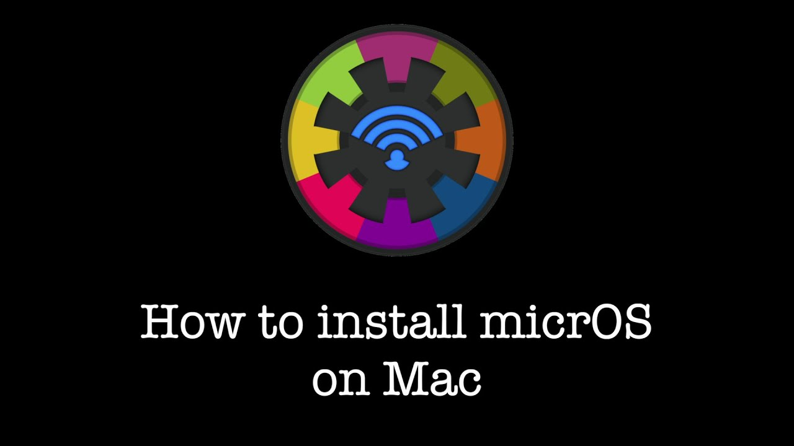
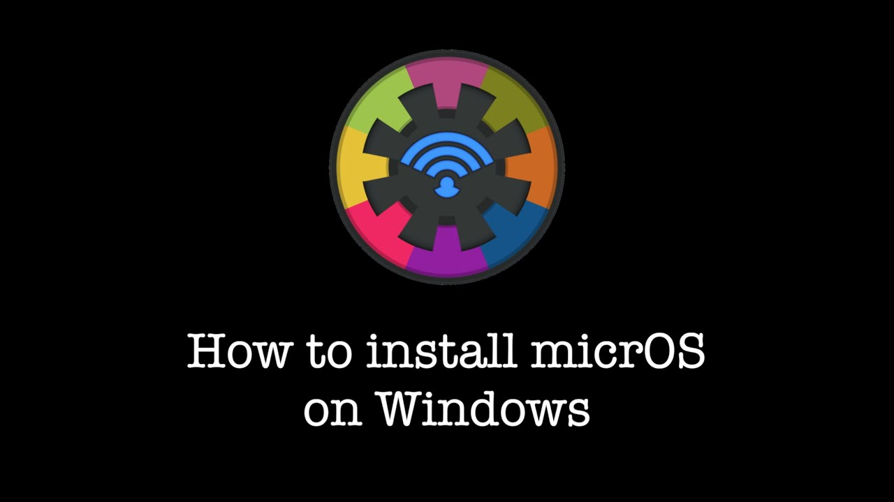
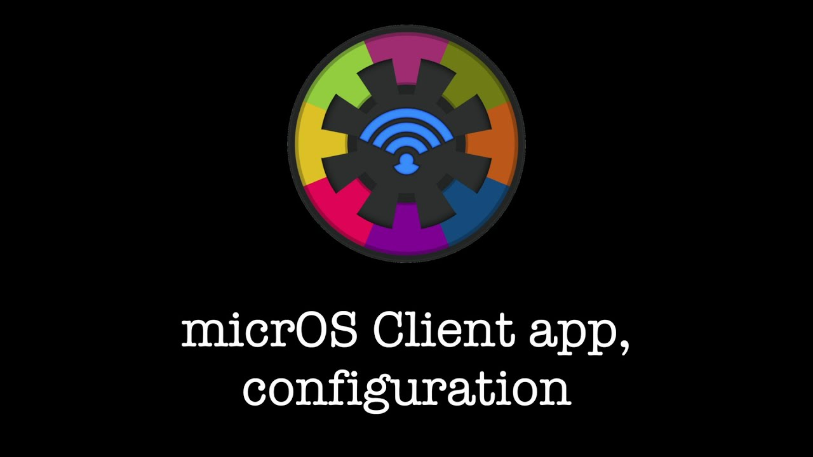
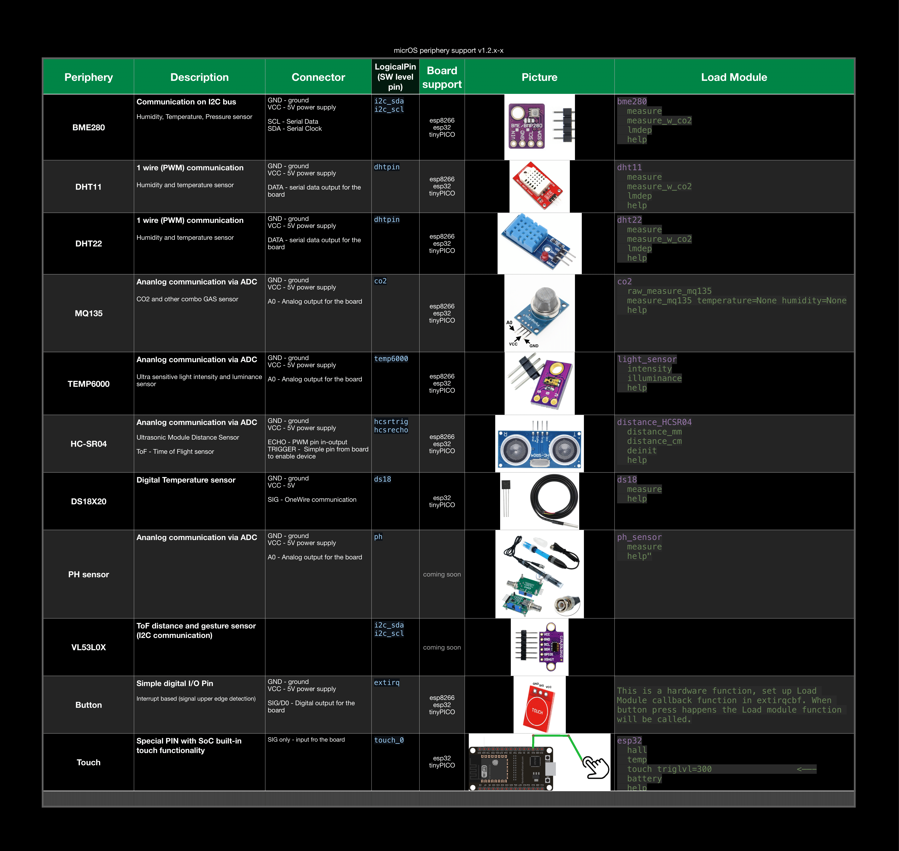
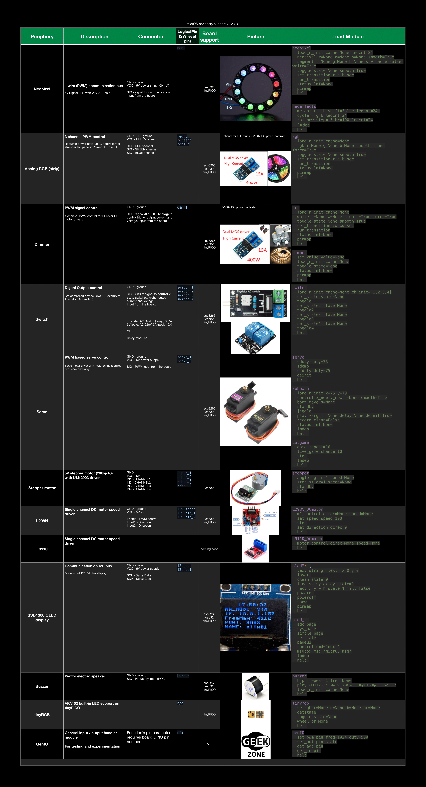
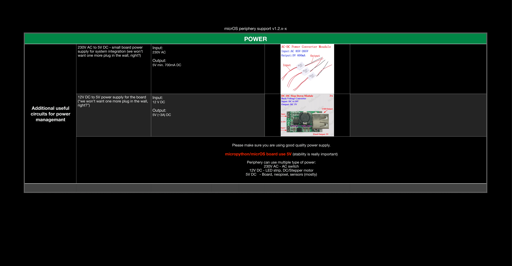

#  micrOS

### micropython based smart edge IoT platform

`#telnet #wifi #esp32 #ota #GPIO #RTC/NTP #AP/STA #IRQ #thread #cron`


📲 💻 Communication over WiFi: Generic communication API <br/>
&nbsp;&nbsp; ✉️ Expose upython module functions - telnet TCP/IP <br/>
⚙️ 📝 Device initialization from user config <br/>
🧩  Codeless end user experience via phone client <br/>
🚪 No external server or service required for client-device communication <br/>
&nbsp;&nbsp; ⚠️ 🛡 Works on Local Network (WiFi-WLAN) <br/>
🛠 Easy to customize, create your own Load Modules: <br/>
&nbsp;&nbsp; 1. Write **LM_**`<your_app>`**.py** <br/>
&nbsp;&nbsp; 2. Copy (OTA/USB) python script to your device (drap&drop)<br/>
&nbsp;&nbsp; 3. Call any function from **`<your_app>`** module <br/>
🦾 Built-in scheduling (IRQs):<br/>
&nbsp;&nbsp; - Time stamp based <br/>
&nbsp;&nbsp; - Geolocation based utc + sunset, sunrise rest features <br/>
&nbsp;&nbsp; - Simple periodic <br/>
&nbsp;&nbsp; - Thread (beta) <br/>

🚀🎈Lightweight and high performance core system that leaves you space 😎

## ◉ Shortcuts:
1. micrOS Client Application [link](https://github.com/BxNxM/micrOS#micrOS-Client-Application)
2. micrOS Installer [link](https://github.com/BxNxM/micrOS/#installing-micros-with-devtoolkit-esp32)
3. micrOS Tutorials [link](https://github.com/BxNxM/micrOS#micros-video-tutorials)
4. micrOS System and features [link](https://github.com/BxNxM/micrOS#micros-system-message-function-visualization)
5. micrOS Node configuration [link](https://github.com/BxNxM/micrOS#micros-node-configuration-parameters-with-description)

Thingiverse 3D print projects: [link](https://www.thingiverse.com/micros_framework/designs)</br>
Youtube: [link](https://www.youtube.com/channel/UChRlJw7OYAoKroC-Mi75joA)</br>
Facebook page: [link](https://www.facebook.com/Micros-Framework-103501302140755/)

----------------------------------------
----------------------------------------

## micrOS Client Application

[](https://apps.apple.com/hu/app/micros-client/id1562342296) &nbsp;&nbsp;&nbsp;&nbsp;&nbsp;&nbsp;&nbsp; [](https://play.google.com/store/apps/details?id=com.BMT.micrOSClient)

----------------------------------------
----------------------------------------

## Installing micrOS with DevToolKit #ESP32
**macOS / Windows / Linux to install any esp32 board**

End-to-End solution for deployment, update, monitor and develop micrOS boards.

I would suggest to use micrOS GUI as a primary interface for micrOS development kit, but you can use cli as well if you prefer.

> Note: The main purpose of the USB deployment scripts to install micropython on the board and put all micrOS resources from `micrOs/toolkit/workspace/precompiled` to the connected board.

<br/>

### 1. Install python3.8

Link for python 3.8 [download](https://www.python.org/downloads/release/python-383/)

> Note: Allow extend system path with that python version (installation parameter) </br>
> On **Windows**: RUN AS ADMINISTARTOR

----------------------------------------

### On macOS

&nbsp;Open command line: press: `commnd+space` + type: `terminal` + press: `enter`

#### 1. Download and install **micrOS devToolKit** python package:

**```python3 -m pip install --upgrade pip; python3 -m pip install git+https://github.com/BxNxM/micrOS.git```**

> Note: macOS will drop a message to install git, please follow the install guide steps. </br>
> FYI: Manual git install on macOS**`xcode-select --install; git --version`**

#### 2. Start micrOS devToolKit GUI

**`devToolKit.py`**

It will open a graphical user interface for micrOS device management, like usb deploy, update, OTA operations, test executions, etc...

----------------------------------------
<br/>

### On Windows:

#### 1. Install git

For python github project download

&nbsp;**[download from here](https://git-scm.com/download/win)**

#### 2. C++ compiler

You will need **C++ compiler** to able to install all python pip dependencies (defined in the tool/requirements.txt and setup.py)*

&nbsp;**[C++ compiler download](https://support.microsoft.com/en-us/topic/the-latest-supported-visual-c-downloads-2647da03-1eea-4433-9aff-95f26a218cc0?fbclid=IwAR3_sC43aIkQ7TaCIyO3LnJAH5YEM22GavxngTS-X08Z2p1rJq12_vrX6FU)**

#### 3. Download and install micrOS devToolKit python package:

Open Windows **Command Prompt**

```
python -m pip install --upgrade pip
python -m pip install git+https://github.com/BxNxM/micrOS.git
```

#### 4. Start micrOS devToolKit GUI

**`devToolKit.py`**

It will open a graphical user interface for micrOS device management, like usb deploy, update, OTA operations, test executions, etc...

----------------------------------------


- Example

```
1. Select BOARD TYPE
2. Select MICROPYTHON VERSION
3. Click on [Deploy (USB)] button
```

It will install your board via USB with default settings. **Continue with micrOS Client app...**

> Note: At the first USB deployment, devToolKit will ask to install **SerialUSB driver** and it will open the driver installer as well, please follow the steps and install the necessary driver.


```
╔╗ ╔╗                  ╔═══╗╔╗ ╔╗╔═╗ ╔╗       ╔═══╗
║║ ║║                  ║╔══╝║║ ║║║║╚╗║║       ╚╗╔╗║
║╚═╝║╔══╗ ╔╗╔╗╔══╗     ║╚══╗║║ ║║║╔╗╚╝║    ╔═╗ ║║║║
║╔═╗║╚ ╗║ ║╚╝║║╔╗║     ║╔══╝║║ ║║║║╚╗║║    ╚═╝ ║║║║
║║ ║║║╚╝╚╗╚╗╔╝║║═╣    ╔╝╚╗  ║╚═╝║║║ ║║║    ╔═╗╔╝╚╝║
╚╝ ╚╝╚═══╝ ╚╝ ╚══╝    ╚══╝  ╚═══╝╚╝ ╚═╝    ╚═╝╚═══╝
```

----------------------------------------

## micrOS Projects


----------------------------------------


----------------------------------------


----------------------------------------

> etc... :) Youtube content coming soon.

----------------------------------------
----------------------------------------


## micrOS Video Tutorials

### 1.1 Prepare micrOS devToolKit for deployment [macOS] - OBSOLETE

[](https://www.youtube.com/watch?v=heqZMTUAWcg&t)

### 1.2 Prepare micrOS devToolKit for deployment [Windows] - OBSOLETE

[](https://www.youtube.com/watch?v=8e_YCjFVZng)

----------------------------------------

### 1.1 Install micrOS devToolKit GUI on macOS (new)

Step-by-step tutorial for micrOS devToolKit GUI install and how to start the GUI on macOS (terminal)

> Coming soon

### 1.2 Install micrOS devToolKit GUI on Windows (new)

Step-by-step tutorial for micrOS devToolKit GUI install and how to start the GUI on windows (PowerShell)

> Coming soon

### 2. Basic setup with micrOS Client App

[](https://www.youtube.com/watch?v=xVNwHnBs1Tw)

### 3. micrOS devToolKit GUI main functionalities

Common on Windows and macOS

Step-by-step tutorial for micrOS devToolKit GUI basic usage: install (usb) and update (ota) boards plus communication based app executions. (How to write custom remote apps will be descriped in later episode)

> Coming soon

### 4. Detailed micrOS Client walkthrough

[Widgets] How to get available module list <br/>
[Pages] Overview of micrOS Client UI <br/>
[Config] Idea behind: network, time, boothook, irqs, cron <br/>
		  Set some stuff in config ... Scheduler, irq (transition) <br/>


### 5. Get familier with micrOS shell - micrOS devToolKit CLI

micrOS terminal <br/>
built-in commands, Load Modules <br/>
LM development <br/>
1. LM_app.py creation (basics python programming) <br/>
2. Upload module with ota update (drag-n-drop LM_app file) <br/>
3. Call LM_app function <br/>

### 7. How to customize or contribute to micrOS

Create custom Load Modules (LMs) - github pull request

----------------------------------------

## micrOS System, message-function visualization


>Note: micrOS development kit contains command line interface for socket communication. Example: `devToolKit.py --connect`

----------------------------------------

## micrOS Framework Features💡

- 🕯**micrOS loader** - starts micrOS or WEBREPL(update / recovery modes)
	- **OTA update** - push update over wifi (webrepl automation) / monitor update and auto restart node
- 📄**Config handling** - user config - **node_config.json**
	- ⏳**Boot phase** - preload Load Module(s)
		- For pinout and last state initialization - based on node_config `boothook`
		- Example values: `rgb load_n_init; neopixel load_n_init`
	- 📡**Network handling** - based on node_config 
		- STA / AP network modes, `nwmd`
		- NTP + UTC aka clock setup
		- Static IP configuration, `devip`
		- dhcp hostname setup, `devfid`.local
	- ⚙️**Scheduling / External events** - Interrupt callback - based on node_config 
		- Time based
			- ⌛️simple LM task pool execution `timirq` & `timirqcbf`
				- `Timer(0)`
			- 🗓cron [time stump:LM task] pool execution `cron` & `crontasks`
				- `Timer(1)` 
				- timestamp: `WD:H:M:S!LM FUNC`, ranges: `0-6:0-23:0-59:0-59!LM FUNC`
					- example: `*:8:0:0!rgb rgb r=10 g=60 b=100; etc.`, it will set rgb color on analog rgb periphery at 8am every day.
				- tag: `sunset` / `sunrise`
					- example: `sunset!rgb rgb r=10 g=60 b=100; etc.`, it will set rgb color on analog rgb periphery at every sunset, every day.
		- 💣Event based
			- Set trigger event `irqX`
				- Trigger up/down/both `irqX_trig`
				- With LM callback function `irqX_cbf`
			- X = 1, 2, 3 or 4

- ⚙️**[L]oad [M]odule** aka **application** handling
	- Lot of built-in functions (table below)
	- Create your own module with 3 easy steps
		- Create a python file, naming convention: `LM_<your_app_name>.py`
			- Replace `<your_app_name>` for anything you prefer!
		- Write python functions, you can call any function from that module...
		- Upload modul with "drag&Drop" with help of devToolKit GUI `devToolKit.py`

- 📨**Socket interpreter** - wireless communication interface with the nodes
	- **System commands**: `help, version, reboot, webrepl, webrepl --update, etc.`
		- After `webrepl --update` command the micrOS system reboots and waits for ota update in webrepl mode.
	- **Config handling** SET/GET/DUMP - **node_config.json**
		- enter configuration mode: `conf`
		- exit configuration mode:`noconf`
		- Print out all parameters and values: `dump`
	- **LM** - Load Module function execution (application modules)
		- Example: `system info`
- 🖇**[L]ogical [P]inout** handling - lookuptables for each board
	- Predefined pinout modules for esp32, tinyPico
	- Create your pinout based on `LP_esp32.py`, naming convencion: `LP_<name>.py`
	- To activate your custom pinout set `cstmpmap` config parameter to `<name>`

- 📍[BETA!] **Background Job** aka **BgJob**
		- Capable of execute [L]oad [M]odules in a background thread
		- WARNING, limitation: not use with IRQs and in micrOS config
		- Invoke with single execution `&` or loop execution `&&`
		- Example:
			- In loop: `system heartbeat &&`
			- Single call: `system heartbeat &`
		- Stop thread: `bgjob stop`
		- Show thread ouput and status: `bgjob show`


⌘ DevToolKit CLI feature:

- Socket client python plugin - interactive - non interactive mode

## Built in pheriphery support

### Sensors / inputes

</br>

### Actuators / outputs

</br>

### Power supply

</br>

----------------------------------------

## Device Pinouts for wiring

### Logical pin association handling

[micrOS/source/LogicalPins.py](./micrOS/source/LogicalPins.py)

LogicalPin lookup tables:

- [tinypico](./micrOS/source/LP_tinypico.py)
- [esp32](./micrOS/source/LP_esp32.py)

> Note: Good idea to use costant variable for pin map declaration, check the files for more info, These files are also precompiled automatically into byte steams -> `.mpy`


GENERAL CONTROLLER CONCEPT: [microPLC](./media/microPLC.png)


----------------------------------------

## micrOS **node configuration**, parameters with description

|        Config keys   |   Default value and type    | Reboot required |       Description       |
| -------------------- | :-------------------------: | :-------------: | ----------------------- |
| **devfid**           |    `node01`  `<str>`        |       Yes        | Device friendly "unique" name - also used for AccessPoint nw mode (AP name)
| **boostmd**          |      `True`  `<bool>`       |      Yes        | boost mode - set up cpu frequency low or high 8MHz-16Mhz-24MHz (depends on boards)
| **staessid**         |   `your_wifi_name` `<str>`  |       Yes       | Wifi router name (for default connection mode)
| **stapwd**           | `your_wifi_passwd` `<str>`  |       Yes       | Wifi router password (for default connection mode)
| **appwd**            |   `ADmin123`  `<str>`       |       Yes       | Device system password.: Used in AP password (access point mode) + webrepl password
| **auth**             |     `False` `<bool>`        |       Yes       | Enables socket password authentication, password: `appwd`. Passwordless functions: `hello`, `version`, `exit`. **WARNING** OTA upade not supported in this mode.
| **utc**              |     `60`   `<int>`          |       Yes       | NTP-RTC - timezone setup (UTC in minute) - it is automatically calibrated in STA mode based on geolocation.
| **boothook**         |    `n/a` `<str>`            |      Yes        | Callback function(s) list for priority Load Module(s) execution in boot sequence [before network setup!]. Add LoadModule(s) here, separator `;`. Example: Set LED colors / Init custom module(s) / etc.
| **timirq**           |     `False`  `<bool>`       |       Yes       | Timer(0) interrupt enabler - background "subprocess" emulation, timer based infinite loop for the LoadModule execution
| **timirqcbf**        |      `n/a`   `<str>`        |      Yes        | if `timirq` enabled, calls the given Load Module(s), e.x.: `module function optional_parameter(s)`, task separator: `;`
| **timirqseq**        |    `1000`   `<int>`         |      Yes        | Timer interrupt period in ms, default: `3000` ms (for `timirq` infinite loop timer value)
| **cron**             |     `False`  `<bool>`       |       Yes       | Cron enabler, Timer(1) interrupt enabler - time based task scheduler.
| **cronseq**          |    `3000`   `<int>`         |       Yes        | Cron (Timer(1)) interrupt period in ms, default: `3000` ms (for `cron` infinite loop timer value) 
| **crontasks**        |     `n/a`  `<str>`          |       Yes        | Cron scheduler input, task format: `WD:H:M:S!module function` e.g.: `1:8:0:0!system heartbeat`, task separator in case of multiple tasks: `;`. [WD:0-6, H:0-23, M:0-59, S:0-59] in case of each use: `*` **Note**: If the value was `n/a` default, then reboot required.
| **irq1**           |     `False`  `<bool>`       |      Yes        | External event interrupt enabler - Triggers when desired signal state detected - button press happens / motion detection / etc
| **irq1_cbf**        |     `n/a`  `<str>`          |      Yes        | `irq1` enabled, calls the given Load Modules, e.x.: `module function optional_parameter(s)` when external trigger happens
| **irq1_trig**       |     `n/a`   `<str>`         |      Yes        | Sets trigger mode for external irq, signal phase detection, values `up` (default: `n/a`) or `down` or `both`.
| **irq2**           |     `False`  `<bool>`       |      Yes        | External event interrupt enabler - Triggers when desired signal state detected - button press happens / motion detection / etc
| **irq2_cbf**        |     `n/a`  `<str>`          |      Yes        | `irq2` enabled, calls the given Load Modules, e.x.: `module function optional_parameter(s)` when external trigger happens
| **irq2_trig**       |     `n/a`   `<str>`         |      Yes        | Sets trigger mode for external irq, signal phase detection, values `up` (default: `n/a`) or `down` or `both`.
| **irq3**           |     `False`  `<bool>`       |      Yes        | External event interrupt enabler - Triggers when desired signal state detected - button press happens / motion detection / etc
| **irq3_cbf**        |     `n/a`  `<str>`          |      Yes        | `irq3` enabled, calls the given Load Modules, e.x.: `module function optional_parameter(s)` when external trigger happens
| **irq3_trig**       |     `n/a`   `<str>`         |      Yes        | Sets trigger mode for external irq, signal phase detection, values `up` (default: `n/a`) or `down` or `both`.
| **irq4**           |     `False`  `<bool>`       |      Yes        | External event interrupt enabler - Triggers when desired signal state detected - button press happens / motion detection / etc
| **irq4_cbf**        |     `n/a`  `<str>`          |      Yes        | `irq4` enabled, calls the given Load Modules, e.x.: `module function optional_parameter(s)` when external trigger happens
| **irq4_trig**       |     `n/a`   `<str>`         |      Yes        | Sets trigger mode for external irq, signal phase detection, values `up` (default: `n/a`) or `down` or `both`.
| **cstmpmap**         |      `n/a`  `<str>`          |      Yes       | Custom pin mapping for custom function setups. (1) copy your pinmap aka [L]ogical[P]ins (python variables in module) to the board, file format: `LP_<pin_map_name>.py` or `.mpy`, (2) set `<pin_map_name>` as the parameter.
| **dbg**	            |     `True`    `<bool>`      |       Yes       | Debug mode - enable micrOS system printout, server info, etc. + progress LED (heartbeat)
| **soctout**          |   `100`      `<int>`        |      Yes        | Socket server connection timeout (because single process socket interface)
| **socport**          |    `9008`  `<int>`          |      Yes        | Socket server service port (should not be changed due to client and API inconpatibility)
| **irqmreq**          |      `6000`  `<int>`        |       No        | Controlls memory overload avoidance (byte). `timirq` requires this amount of memory for activation. `irqmreq`*0.7 is the memory limit for `extirq` enabling. **WARNING**: If the system gets memory overloaded with irq(s) micropython crashes and stucks in cycling reboot!!!
| **devip**            |      `n/a`  `<str>`         |    Yes(N/A)      | Device IP address, (first stored IP in STA mode will be the device static IP on the network), you are able to provide specific static IP here.
| **nwmd**             |     `n/a`  `<str>`          |      N/A        | Prefered network mode - `AP` or `STA`
| **hwuid**            |      `n/a`  `<str>`         |      N/A        | USED BY SYSTEM (state storage) - hardware address - dev uid
| **guimeta**          |      `n/a`  `str`           |      No        | USED BY micrOS Client (state storage) - stores - offloaded parameter type in config. Clinet widget meta data.

> Note: Default empty value: `n/a` in case of string parameter.
> Note: Cron is only available on devices with Timer(**1**): esp32

----------------------------------------
----------------------------------------

# Networking - automatic network modes


# System Architecture 


> Secure Core (OTA static modules): `boot.py`, `micrOSloader.mpy`, `Network.mpy`, `ConfigHandler.mpy`, `Debug.mpy`


### RELESE NOTE

|  VERSION (TAG) |    RELEASE INFO    |  MICROS CORE MEMORY USAGE  |  SUPPORTED DEVICE(S) | APP PROFILES | Load Modules  |     NOTE       |
| :----------: | :----------------: | :------------------------:   |  :-----------------: | :------------: | :------------:| -------------- |
|  **v0.1.0-0** | [release_Info-0.1.0-0](./release_info/micrOS_ReleaseInfo/release_0.1.0-0_note.md)| 13 - 28 % (1216-2544byte) | esp8266 | [App Profiles](./release_info/node_config_profiles) | [LM manual](./release_info/micrOS_ReleaseInfo/release_sfuncman_0.1.0-0.json)| Stable Core with applications - first release
|  **v0.4.0-0** | [release_Info-0.4.0-0](./release_info/micrOS_ReleaseInfo/release_0.4.0-0_note_esp8266.md)| 26 - 53 % (2512-5072byte) | esp8266 | [App Profiles](./release_info/node_config_profiles) | [LM manual](./release_info/micrOS_ReleaseInfo/release_sfuncman_0.4.0-0.json)| micrOS multi device support with finalized core and so more. OTA update feature.
|  **v0.4.0-0** | [release_Info-0.4.0-0](./release_info/micrOS_ReleaseInfo/release_0.4.0-0_note_esp32.md)| 23 - 28 % (17250-20976byte) | esp32 | [App Profiles](./release_info/node_config_profiles) | [LM manual](./release_info/micrOS_ReleaseInfo/release_sfuncman_0.4.0-0.json)| micrOS multi device support with finalized core and advanced task scheduler based on time, and and so more. OTA update feature.
|  **v1.0.0-0** | [release_Info-1.0.0-0](./release_info/micrOS_ReleaseInfo/release_1.0.0-0_note_esp32.md)| 15 - 23 % (10394-15488byte) | esp32 | [App Profiles](./release_info/node_config_profiles) | [LM manual](./release_info/micrOS_ReleaseInfo/release_sfuncman_1.0.0-0.json)| Release of v1 micrOS, timer and event based irqs, cron task scheduling, realtime communication, multiple device support. OTA, etc. 
|  **v1.2.2-0** | [release_Info-1.2.2-0](./release_info/micrOS_ReleaseInfo/release_1.2.2-0_note_esp32.md)|  10-25 % | esp32 | [App Profiles](./release_info/node_config_profiles) | [LM manual](./release_info/micrOS_ReleaseInfo/release_sfuncman_1.2.2-0.json)| Public Release of v1 micrOS, timer and event based irqs, cron task scheduling, realtime communication, multiple device support. OTA update, thread from socket shell (beta) etc.
|  **v light-1.3.0-0** | None |  % | esp8266 | [lightweight branch](https://github.com/BxNxM/micrOS/tree/lightweight)| remove esp8266 due to memory limitation - BUT still supported with limited functionalities on **`lightweight`** branch. Hint: Change branch on github and download zip file, then start micrOSDevToolKit dashboard GUI
|  **v 1.3.0-0** | None |  % | esp32, tinyPico | None | Refactor, IRQ callback scheduling (4 input), thread invocation over socket cli, cron - timed task scheduler, etc... :)


----------------------------------------
----------------------------------------


## Developer Quick guide

#### Erase device & Deploy micropython & Install micrOS 

Go to micrOS repo, where the `devToolKit.py` located.

```bash
devToolKit.py --make
```
> Note: Follow the steps :)


Search and Connect to the device

```
devToolKit.py -s -c
```

----------------------------------------

**User commands**

```
devToolKit.py -h

optional arguments:
  -h, --help            show this help message and exit

Base commands:
  -m, --make            Erase & Deploy & Precompile (micrOS) & Install (micrOS)
  -r, --update          Update/redeploy connected (usb) micrOS. - node config will be restored
  -s, --search_devices  Search devices on connected wifi network.
  -o, --OTA             OTA (OverTheArir update with webrepl)
  -c, --connect         Connect via socketclinet
  -p CONNECT_PARAMETERS, --connect_parameters CONNECT_PARAMETERS
                        Parameters for connection in non-interactivve mode.
  -a APPLICATIONS, --applications APPLICATIONS
                        List/Execute frontend applications. [list]
  -stat, --node_status  Show all available micrOS devices status data.
  -cl, --clean          Clean user connection data: device_conn_cache.json
```

**Search devices**

```
devToolKit.py --search_devices

or

devToolKit.py -s
```

**List discovered devices with status updates**

```
devToolKit.py -stat

or

devToolKit.py --node_status
```

Output:

```
       [ UID ]                [ FUID ]		[ IP ]		[ STATUS ]	[ VERSION ]	[COMM SEC]
__localhost__                 __simulator__     127.0.0.1	OFFLINE		<n/a>		n/a
micrf008d1d2ac30OS            BedLamp           192.168.1.78	ONLINE		1.4.0-1		0.787
micr7c9ebd07a6d0OS            LedGenisys        192.168.1.71	ONLINE		1.3.3-2		1.430
micr240ac4f679e8OS            Chillight         192.168.1.91	ONLINE		1.4.0-0		0.780
micr3c61052fa788OS            RoboArm           192.168.1.79	ONLINE		1.4.0-0		0.539
micr500291863428OS            TinyDevBoard      192.168.1.73	ONLINE		1.4.0-1		1.363
```

**Other Developer commands**

```
Development & Deployment & Connection:
  -f, --force_update    Force mode for -r/--update and -o/--OTA
  -e, --erase           Erase device
  -d, --deploy          Deploy micropython
  -i, --install         Install micrOS on micropython
  -l, --list_devs_n_bins
                        List connected devices & micropython binaries.
  -ls, --node_ls        List micrOS node filesystem content.
  -u, --connect_via_usb
                        Connect via serial port - usb
  -b, --backup_node_config
                        Backup usb connected node config.
  -sim, --simulate      start micrOS on your computer in simulated mode
  -cc, --cross_compile_micros
                        Cross Compile micrOS system [py -> mpy]
  -gw, --gateway        Start micrOS Gateway rest-api server
  -v, --version         Get micrOS version - repo + connected device.
```

## Socket terminal example - non interactive

### Identify device

```
devToolKit.py -c -p '--dev slim01 hello'
Load MicrOS device cache: /Users/bnm/Documents/NodeMcu/MicrOs/tools/device_conn_cache.json
Activate MicrOS device connection address
[i]         FUID        IP               UID
[0] Device: slim01 - 10.0.1.73 - 0x500x20x910x680xc0xf7
Device was found: slim01
hello:slim01:0x500x20x910x680xc0xf7
```

### Get help

```
devToolKit.py -c -p '--dev BedLamp help'

Device was found: BedLamp
node01 $  help
[MICROS]   - commands (SocketServer built-in)
   hello   - default hello msg - identify device
   version - shows micrOS version
   exit    - exit from shell socket prompt
   reboot  - system safe reboot
   webrepl - start web repl for file transfers - update
[CONF] Configure mode (InterpreterShell built-in):
  conf       - Enter conf mode
    dump       - Dump all data
    key        - Get value
    key value  - Set value
  noconf     - Exit conf mode
[EXEC] Command mode (LMs):
   L298N_DCmotor
                help
   bme280
         help
   co2
      help
   dht11
        help
   dht22
        help
   dimmer
         help
   distance_HCSR04
                  distance_mm
                  distance_cm
                  deinit
                  help
   intercon
           help
   light_sensor
               help
   motion_sensor
                get_PIR_state
                PIR_deinit
                help
   neopixel
           help
   rgb
      help
   rgbfader
           help
   servo
        help
   switch
         help
   system
         help
   tinyrgb
          help
   tinyrgb
          setrgb
          getstate
          toggle
          wheel
          help
```
 
### Embedded config handler
 
```  
devToolKit.py -c -p '--dev BedLamp conf <a> dump'

[configure] BedLamp
stapwd    :          <your-wifi-passwd>
  irq2      :        False
  irq1      :        True
  timirq    :        True
  irq3      :        False
  irq4      :        False
  hwuid     :        micrf008d1d2ac30OS
  devip     :        192.168.1.78
  irq4_trig :        n/a
  auth      :        False
  cron      :        True
  irq1_cbf  :        neopixel toggle
  timirqcbf :        neopixel run_transition
  devfid    :        BedLamp
  irq1_trig :        n/a
  irq4_cbf  :        n/a
  boothook  :        neopixel load_n_init ledcnt=8
  utc       :        120
  irqmreq   :        6000
  socport   :        9008
  timirqseq :        1000
  nwmd      :        STA
  cronseq   :        3000
  appwd     :        ADmin123
  crontasks :        *:7:30:0!neopixel set_transition 255 56 5 1800;*:9:10:0!neopixel set_transition 3 58 156;*:12:0:0!neopixel set_transition 0 14 38 400;*:16:12:0!neopixel set_transition 181 54 0 180;*:0:0:0!neopixel set_transition 0 0 0 900;*:*:*:10!system ha_sta
  boostmd   :        True
  irq2_trig :        n/a
  version   :        1.4.0-1
  soctout   :        100
  irq3_trig :        n/a
  guimeta   :        ...
  cstmpmap  :        n/a
  dbg       :        True
  irq2_cbf  :        n/a
  irq3_cbf  :        n/a
  staessid  :        <your-wifi-name>
```

### Load Modules - User defined functions

```
devToolKit.py -c -p '--dev BedLamp system info'

CPU clock: 24 [MHz]
Free RAM: 14 kB 256 byte
Free fs: 87 %
upython: v1.17 on 2021-09-02
board: ESP32 module with ESP32
mac: f0:08:d1:d2:ac:30
```

## SocketClient

### Config:

micrOS/toolkit/user_data/device_conn_cache.json

```json
{
    "micrf008d1d2ac30OS": [
        "192.168.1.78",
        9008,
        "BedLamp"
    ],
        "node uid": [
        "node ip",
        node port,
        "node name"
    ]
}
```

#### Interactive mode

```
./devToolKit.py -c 
or
./devToolKit.py -connect
Load MicrOS device cache: /Users/bnm/Documents/NodeMcu/MicrOs/tools/device_conn_cache.json
Activate MicrOS device connection address
[i]         FUID        IP               UID
[0] Device: node01 - 10.0.1.119 - 0x500x20x910x680xc0xf7
Choose a device index: 0
Device IP was set: 10.0.1.119
node01 $  help
[MICROS]   - commands (SocketServer built-in)
   hello   - default hello msg - identify device
   version - shows micrOS version
   exit    - exit from shell socket prompt
   reboot  - system safe reboot
   webrepl - start web repl for file transfers - update
[CONF] Configure mode (InterpreterShell built-in):
  conf       - Enter conf mode
    dump       - Dump all data
    key        - Get value
    key value  - Set value
  noconf     - Exit conf mode
[EXEC] Command mode (LMs):
   L298N_DCmotor
                help
   VL53L0X
          measure
          help
   adc
      measure
      action_fltr
      help
   air
      help
   ...
node01 $  exit
Bye!

```

## Project structure

### micrOS resources library

#### micrOS Core

```
micrOS/source/
     245	BgJob.py
      67	Common.py
     217	ConfigHandler.py
     102	Debug.py
      54	Hooks.py
      85	InterConnect.py
     164	InterpreterCore.py
     199	InterpreterShell.py
     141	InterruptHandler.py
      46	LP_esp32.py
      55	LP_tinypico.py
      44	LogicalPins.py
     176	Network.py
     161	Scheduler.py
     292	SocketServer.py
     172	Time.py
      24	TinyPLed.py
      19	boot.py
      64	micrOS.py
     108	micrOSloader.py
       5	reset.py
SUM OF CODE LINES: 2440
```

#### micrOS Load Modules

```
micrOS/source/
      59	LM_L298N_DCmotor.py
      37	LM_L9110_DCmotor.py
     310	LM_VL53L0X.py
     273	LM_bme280.py
     194	LM_buzzer.py
      24	LM_catgame.py
     177	LM_cct.py
     103	LM_co2.py
      32	LM_dht11.py
      32	LM_dht22.py
      90	LM_dimmer.py
      57	LM_distance_HCSR04.py
      36	LM_ds18.py
      24	LM_esp32.py
      67	LM_genIO.py
      19	LM_i2c.py
      31	LM_intercon.py
      55	LM_light_sensor.py
     108	LM_neoeffects.py
     206	LM_neopixel.py
     161	LM_oled.py
     172	LM_oled_ui.py
      30	LM_pet_feeder.py
      50	LM_ph_sensor.py
     198	LM_rgb.py
     155	LM_roboarm.py
      40	LM_robustness.py
      89	LM_servo.py
     110	LM_stepper.py
     179	LM_switch.py
     155	LM_system.py
      60	LM_tinyrgb.py
SUM OF CODE LINES: 3333
```

> LM (Load Modules) - Application logic - accessable over socket server as a command

### micrOS devToolkit resources

#### DevToolKit Dashboard apps

> You can easly copy the `Template_app.py`, and create a new socket based app.
[Template_app.py](https://github.com/BxNxM/micrOS/blob/master/toolkit/dashboard_apps/Template_app.py)

```
micrOS/toolkit/dashboard_apps
│   ├── AirQualityBME280_app.py
│   ├── AirQualityDHT22_CO2_app.py
│   ├── AnalogCCT_app.py
│   ├── AnalogRGB_app.py
│   ├── CatGame_app.py
│   ├── Dimmer_app.py
│   ├── GetVersion_app.py
│   ├── GetVersion_app.pyc
│   ├── NeopixelTest_app.py
│   ├── RoboArm_app.py
│   ├── SysCheck_app.py
│   ├── Template_app.py
```

#### Stored connection data and default node configs

```
micrOS/toolkit/user_data
│   ├── device_conn_cache.json        <- connection cache
│   └── node_config_archive
│       ├── BigRGB-node_config.json
│       ├── Chillight-node_config.json
│       ├── Kapcsolo230-node_config.json
│       ├── LampController-node_config.json
│       ├── MeasureNode-node_config.json
│       ├── MrGreen-node_config.json
│       ├── RingLamp-node_config.json
│       └── test-node_config.json
```

#### Virtaulenv for development and stored USB-Serial drivers

```
micrOS/env/
├── __init__.py
├── driver_cp210x
│   ├── CP210x_Universal_Windows_Driver
│   └── macOS_VCP_Driver
├── requirements.txt
└── venv
    ├── bin
    ├── include
    ├── lib
    └── pyvenv.cfg
```

#### Precompiled resources for easy install

```
micrOS/toolkit/workspace/precompiled
    │   ├── BgJob.mpy
    │   ├── Common.mpy
    │   ├── ConfigHandler.mpy
    │   ├── Debug.mpy
    │   ├── Hooks.mpy
    │   ├── InterConnect.mpy
    │   ├── InterpreterCore.mpy
    │   ├── InterpreterShell.mpy
    │   ├── InterruptHandler.mpy
    │   ├── LM_L298N_DCmotor.mpy
    │   ├── LM_L9110_DCmotor.py
    │   ├── LM_VL53L0X.py
    │   ├── LM_bme280.mpy
    │   ├── LM_buzzer.mpy
    │   ├── LM_catgame.py
    │   ├── LM_cct.mpy
    │   ├── LM_co2.mpy
    │   ├── LM_dht11.mpy
    │   ├── LM_dht22.mpy
    │   ├── LM_dimmer.mpy
    │   ├── LM_distance_HCSR04.py
    │   ├── LM_ds18.mpy
    │   ├── LM_esp32.py
    │   ├── LM_genIO.mpy
    │   ├── LM_i2c.py
    │   ├── LM_intercon.mpy
    │   ├── LM_light_sensor.mpy
    │   ├── LM_neoeffects.mpy
    │   ├── LM_neopixel.mpy
    │   ├── LM_oled.mpy
    │   ├── LM_oled_ui.mpy
    │   ├── LM_pet_feeder.py
    │   ├── LM_ph_sensor.py
    │   ├── LM_rgb.mpy
    │   ├── LM_roboarm.mpy
    │   ├── LM_robustness.py
    │   ├── LM_servo.mpy
    │   ├── LM_stepper.mpy
    │   ├── LM_switch.mpy
    │   ├── LM_system.mpy
    │   ├── LM_tinyrgb.mpy
    │   ├── LP_esp32.mpy
    │   ├── LP_tinypico.mpy
    │   ├── LogicalPins.mpy
    │   ├── Network.mpy
    │   ├── Scheduler.mpy
    │   ├── SocketServer.mpy
    │   ├── Time.mpy
    │   ├── TinyPLed.mpy
    │   ├── boot.py
    │   ├── micrOS.mpy
    │   ├── micrOSloader.mpy
    │   └── reset.mpy
```

> Note: From the `micrOS/source/` by default the LMs are not compiling, to extend complied LM list add LM explicitly to the following file:

```
micrOs/toolkit/LM_to_compile.dat
```

----------------------------------------

## HINTS

- Save **screen** console buffer (**output**)
Press `ctrl + A :` and type `hardcopy -h <filename>`

- Create callgraph: [pycallgraph](http://pycallgraph.slowchop.com/en/master/)

- Convert PNG/JPG-s to GIF: `convert -delay 60 ./*.png mygif.gif`

- **micrOS core source code** lines:

```bash
core_files=($(ls -1 | grep '.py' | grep -v 'LM_')); all_line_codes=0; for coref in ${core_files[@]}; do content_lines_cnt=$(cat $coref | grep -v -e '^$' | wc -l); all_line_codes=$((all_line_codes+content_lines_cnt)); echo -e "$content_lines_cnt\t$coref"; done; echo -e "SUM OF CODE LINES: $all_line_codes"
```

- **micrOS Load Module-s** (application-s) source code lines:

```
core_files=($(ls -1 | grep '.py' | grep 'LM_')); all_line_codes=0; for coref in ${core_files[@]}; do content_lines_cnt=$(cat $coref | grep -v -e '^$' | wc -l); all_line_codes=$((all_line_codes+content_lines_cnt)); echo -e "$content_lines_cnt\t$coref"; done; echo -e "SUM OF CODE LINES: $all_line_codes"
```

GIT:
- Add git tag: `git tag -a vX.Y.Z-K -m "tag message"`

- Publish tags: `git push origin --tags`

- Pretty git view: `git log --pretty=oneline`

- File change list: `git diff --name-only fbb4875609a3c0ee088b6a118ebf9f8a500be0fd HEAD | grep 'mpy-MicrOS'`

- GitHub embed youtube link: `https://github.com/itskeshav/Add-youtube-link-in-Readme.md`

git push -u origin master
