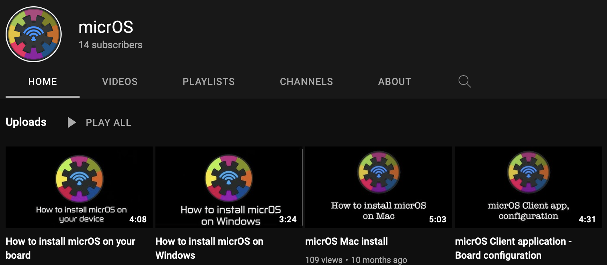
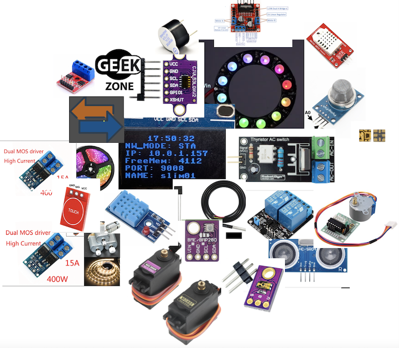

#  micrOS

A local-first automation platform for Wi-Fi-enabled MicroPython boards.

Build a network-controlled lamp, read a sensor over Socket/HTTP, or let one board trigger another. micrOS turns a compatible Wi-Fi microcontroller into a programmable automation node—without a required cloud service.

Write the hardware behavior in [MicroPython](http://micropython.org); micrOS
handles networking, configuration, background jobs, scheduling, interrupts and updates.

> micrOS is a network-addressable edge application platform for MicroPython MCUs, built around a dynamically loadable plug-in architecture.

[](https://pypi.org/project/micrOSDevToolKit/)

[](https://github.com/BxNxM/micrOS/discussions)
[](https://hub.docker.com/r/bxnxm/micros-gateway)

### Contents

- 🎬 [See it in action](#see-it-in-action)
- 🚀 [Start using micrOS](#start-using-micros) — installation, Wi-Fi setup, and first commands
- 📦 [Applications](https://htmlpreview.github.io/?https://github.com/BxNxM/micrOS/blob/master/micrOS/client/sfuncman/sfuncman.html) · [micrOS Packages](https://github.com/BxNxM/micrOSPackages)
- 🌐 [Network modes](#networking-modes) · [Configuration parameters](#node-configuration-reference)
- 💬 [Tutorials and community](#tutorials-and-community)
- ⚙️ [Advanced use](#advanced-use) — automation, hardware, configuration, and developer tools
- 🧩 [Create a Load Module](./micrOS/MODULE_GUIDE.md) · [Architecture](./micrOS/ARCHITECTURE.md)
- 📝 [Cheat sheets and maintainer notes](#operations-and-maintainer-notes)

[](./media/lms/web.png)

_The optional on-device web UI: REST console, configuration, application controls,
and file management._

### Why micrOS?

- **One function, several ways to use it.** Public functions in `LM_*.py` Load
  Modules are callable from the shell, REST API, schedules, interrupts, and
  background jobs.
- **Local control.** Clients connect directly to nodes over Wi-Fi. No cloud
  account or always-on server is required; time and sunrise/sunset lookups use
  external services.
- **A runtime you can build on.** STA/AP networking, NTP/RTC, pin mapping, async
  tasks, OTA updates, and device-to-device commands are included.
- **Load only what you need.** Modules are imported on demand and stay resident.
  Available memory determines how many you can combine.

### Who is it for?

For MicroPython developers who want reusable device infrastructure, makers
building local automation, hardware experimenters adding sensors or actuators,
and developers connecting several nodes over sockets or ESP-NOW.

### See it in action

| Ring Lamp | RoboArm | RGB + CCT lighting |
| --- | --- | --- |
| [](https://youtu.be/BlQzAnFtpLk) |  |  |
| Generated controls for a 24-pixel NeoPixel lamp. | A Wi-Fi-controlled servo application and laser cat toy. | Full-color and tunable-white LED control from one node. |

Start with an existing application, then add your own behavior as a Load Module.

<a id="installing-micros-with-devtoolkit-esp32-and-more"></a>

<a id="quick-start"></a>

## Start using micrOS

You only need three ideas: a **node** is your board running micrOS;
**DevToolKit** installs and connects to it from your computer; a **Load Module**
is a Python application on the board. You don't need to understand the runtime
internals to use an existing application.

Before you begin, have a compatible Wi-Fi MicroPython board, a USB data cable,
a computer, and your Wi-Fi credentials ready. Check the
[firmware catalog](./micrOS/micropython/README.md) for your board; see
[boards and memory](#boards-and-memory) for larger applications.

Follow these four steps to get a node online and make your first request.

Use DevToolKit on macOS, Linux, or Windows to deploy your first node. Start with
the GUI; the CLI supports interactive use and automation.

[](https://pypi.org/project/micrOSDevToolKit/)

### 1. Install Python and DevToolKit

Install [Python 3.12 or newer](https://www.python.org/downloads/) and add it to
your system path. The original setup used [Python 3.12.0](https://www.python.org/downloads/release/python-3120/).

On macOS, open Terminal with `Command+Space`, type `terminal`, and press Enter.
On Windows, press `Windows+R`, type `powershell`, and press Enter.

On macOS or Linux:

```bash
python3 -m venv .venv
source .venv/bin/activate
python3 -m pip install --upgrade pip
python3 -m pip install micrOSDevToolKit
```

Verify the Python installation with `python3 --version`. Update DevToolKit later
with `python3 -m pip install --upgrade micrOSDevToolKit`.

On Windows PowerShell:

```powershell
python -m venv .venv
.\.venv\Scripts\Activate.ps1
python -m pip install --upgrade pip
python -m pip install micrOSDevToolKit
```

Activate the environment again when opening a new terminal. If PowerShell
blocks activation, use Command Prompt with `.venv\Scripts\activate.bat`.
On Windows, update with `python -m pip install --upgrade micrOSDevToolKit`.

Run package installation as a normal user; approve administrator access only
for USB-driver installation.

### 2. Deploy micrOS over USB

Start the graphical toolkit:

```bash
devToolKit.py
```


1. Connect your board over USB.
2. Select the matching board and MicroPython firmware from the available lists.
3. Select **Deploy (USB)** and confirm the operation.
4. Wait for deployment to complete and the board to restart.

On first deployment, DevToolKit may offer to install the Serial USB driver
required by your platform.

**Deploy (USB) erases existing firmware and files.** Back up a board you already
use. The first toolkit launch installs optional GUI, compiler, and media
dependencies; keep internet access available until it finishes.

### 3. Configure Wi-Fi and open the web UI

On first startup, an unconfigured node creates its own Wi-Fi access point
when it cannot connect to your network:

1. Connect your computer to the `node01` Wi-Fi network using the
   factory password `ADmin123`.
2. Start `devToolKit.py -s -c` and select `__device_on_AP__` at `192.168.4.1`.
3. Enter these commands **one line at a time in the micrOS shell**. Replace the
   angle-bracket placeholders, including the brackets, with your own values.
   The device password must be 8–9 characters long and contain uppercase and
   lowercase letters and a digit. Check that each setting succeeds.

```text
conf
staessid <your-wifi-name>
stapwd <your-wifi-password>
devfid MyNode
appwd <new-device-password>
webui True
noconf
reboot
```

`webui True` enables the web interface. No boot-hook configuration is needed.

4. Reconnect your computer or phone to the normal local network.
5. Open `http://MyNode.local` in a browser. If you see **🚀 Load Web Apps**,
   click it to load the dashboard and configuration apps. The page reloads
   with links to the available apps.

If `.local` does not resolve, use the node IP shown by discovery or your router:
`http://<node-ip>`. The toolkit's default AP address is `192.168.4.1`; another
MicroPython port may use a different address. Keep your computer connected to
the board's Wi-Fi even if it reports that the network has no internet access.

If you deploy a previously prepared configuration containing valid Wi-Fi
credentials, the node can join that network directly and the access-point
configuration step is unnecessary. Change the factory device password during
initial setup.

### 4. Confirm the installation


Open `http://MyNode.local/rest/system/info` to call the first REST endpoint, or
connect through DevToolKit and try the shell:

```text
help
system info
system heartbeat
```

`system info` reports the board, MicroPython version, memory, filesystem, and
uptime. `help all` lists the installed Load Modules. From there, use the
[application catalog](https://htmlpreview.github.io/?https://github.com/BxNxM/micrOS/blob/master/micrOS/client/sfuncman/sfuncman.html)
or create a [custom Load Module](./micrOS/MODULE_GUIDE.md).

The dashboard displays controls for modules with widget metadata, so a fresh
node may have few controls until you load an application. Protected
configuration operations may prompt for your device password.

### What to try next

Choose a module from the [application catalog](https://htmlpreview.github.io/?https://github.com/BxNxM/micrOS/blob/master/micrOS/client/sfuncman/sfuncman.html),
check its wiring and help, then try its commands. The shell uses
`module function`; HTTP uses `/rest/module/function`, as in the system-info
example above. Module and hardware availability depend on your deployment.

You now have the basics. Use the network modes and configuration tables below
as your everyday reference; continue to Advanced use for custom behavior,
automation, different firmware, or multi-node tooling.

<a id="micros-video-tutorials"></a>

### Tutorials and community

[](https://www.youtube.com/channel/UChRlJw7OYAoKroC-Mi75joA)
[](https://www.instagram.com/micros_framework/)
[](https://www.facebook.com/Micros-Framework-103501302140755)
[](https://www.thingiverse.com/micros_framework/designs)

[](https://www.youtube.com/channel/UChRlJw7OYAoKroC-Mi75joA)

Questions, ideas, and technical requests are welcome in
[GitHub Discussions](https://github.com/BxNxM/micrOS/discussions). If micrOS is
useful to you, a GitHub star helps other MicroPython and embedded-automation
developers find it.


---

<a id="networking-modes"></a>

<a id="how-it-works"></a>

### Network modes


A node normally joins the local Wi-Fi network in station mode. It can fall back
to its own access point for configuration. Set `nwmd`, `staessid`, `stapwd`,
and `devip` using the configuration reference below. Clients communicate directly
with a node; nodes can invoke each other over sockets or ESP-NOW.


<a id="micros-node-configuration-parameters-with-description"></a>

### Node configuration reference

These parameters control micrOS core functionality and allow an entire system
to be assembled from configuration.

#### Basic parameters:

|      Config keys    |   Default value and type    | Reboot required |              Description                     |
| :-----------------: | :-------------------------: | :-------------: | ----------------------------------------- |
|   **`devfid`**      |    `node01`  `<str>`        |       No       | Device friendly "unique" ID - (1) defines AccessPoint (AP) network name and (2) in Station (STA) network mode the DHCP device name for IP address resolve also (3) this is the ShellCli prompt.
|   **`staessid`**    |   `your_wifi_name` `<str>`  |       Yes       | Wifi router name to connect (for STA default connection mode). You can list multiple wifi names separated with `;`
|   **`stapwd`**      | `your_wifi_passwd` `<str>`  |       Yes       | Wifi router password (for STA default connection mode). You can list multiple wifi passwords separated with `;` connected in order to `staessid` wifi names.
|   **`appwd`**       |   `ADmin123`  `<str>`       |       Yes       | Device system password.: Used in AP password (access point mode) + webrepl password + micrOS auth
| **`boothook`**      |    `n/a` `<str>`            |      Yes        | Add Load Module execution(s) to the boot sequence. Separator `;`. Examples: `rgb load; cct load` but you can call any load module function here if you want to run it at boot time.
| **`webui`**         |       `False`  `bool`       |      Yes        | Launch http rest server on port 80 (in parallel with micrOS shell on port 9008 aka `socport`). It has 2 endpoints: / aka main page (index.html) and /rest aka rest (json) interface for load module execution. Example: `<devfid>.local` or `<devfid>.local/rest` + optional parameters: `/rgb/toggle`. **Apple shortcuts compatible**
| **`espnow`**         |     `False`  `bool`       |      Yes        | Enable **ESPNow communication protocol**. It starts `espnow.server` task, that can receive espnow messages and execute Load Module commands. It is an extension for **InterCon** feature example: `system heartbeat >>target.local`.
| | |
| **`cron`**          |     `False`  `<bool>`       |       Yes       | Enable timestamp based Load Module execution aka Cron scheduler (linux terminology), Timer(1) hardware interrupt enabler.
| **`crontasks`**     |     `n/a`  `<str>`          |       No       | Cron scheduler input, task format: `WD:H:M:S!module function` e.g.: `1:8:0:0!system heartbeat`, task separator in case of multiple tasks: `;`. [WD:0-6, H:0-23, M:0-59, S:0-59] in case of each use: `*`. Instead `WD:H:M:S` you can use suntime tags: `sunset`, `sunrise`, optional offset: `sunset+-<minutes>`, `sunrise+-<minutes>`, example: `sunset-30!system heartbeat`. Range of days: WD can be conrete day number or range like: 0-2 means Monday to Wednesday.
| | |
| **`irq1`**          |     `False`  `<bool>`       |      Yes        | External event interrupt enabler - Triggers when desired signal state detected - button press happens / motion detection / etc.
| **`irq1_cbf`**      |     `n/a`  `<str>`          |      Yes        | `irq1` enabled, calls the given Load Modules, e.x.: `module function optional_parameter(s)` when external trigger happens.
| **`irq1_trig`**     |     `n/a`   `<str>`         |      Yes        | Sets trigger mode for external irq, signal phase detection, values `up` (default: `n/a`) or `down` or `both`.
| **`irq2`**          |     `False`  `<bool>`       |      Yes        | External event interrupt enabler - Triggers when desired signal state detected - button press happens / motion detection / etc.
| **`irq2_cbf`**      |     `n/a`  `<str>`          |      Yes        | `irq2` enabled, calls the given Load Modules, e.x.: `module function optional_parameter(s)` when external trigger happens.
| **`irq2_trig`**     |     `n/a`   `<str>`         |      Yes        | Sets trigger mode for external irq, signal phase detection, values `up` (default: `n/a`) or `down` or `both`.
| **`irq3`**          |     `False`  `<bool>`       |      Yes        | External event interrupt enabler - Triggers when desired signal state detected - button press happens / motion detection / etc.
| **`irq3_cbf`**      |     `n/a`  `<str>`          |      Yes        | `irq3` enabled, calls the given Load Modules, e.x.: `module function optional_parameter(s)` when external trigger happens.
| **`irq3_trig`**     |     `n/a`   `<str>`         |      Yes        | Sets trigger mode for external irq, signal phase detection, values `up` (default: `n/a`) or `down` or `both`.
| **`irq4`**          |     `False`  `<bool>`       |      Yes        | External event interrupt enabler - Triggers when desired signal state detected - button press happens / motion detection / etc.
| **`irq4_cbf`**      |     `n/a`  `<str>`          |      Yes        | `irq4` enabled, calls the given Load Modules, e.x.: `module function optional_parameter(s)` when external trigger happens.
| **`irq4_trig`**     |     `n/a`   `<str>`         |      Yes        | Sets trigger mode for external irq, signal phase detection, values `up` (default: `n/a`) or `down` or `both`.
| **`irq_prell_ms`**  |      `300`   `<int>`        |      Yes        | "Prell": contact recurrence (hw property), for fake event filtering... :D Time window to ignore external IRQ events in ms.
| | |
| **`timirq`**        |     `False`  `<bool>`       |       Yes       | Timer(0) interrupt enabler - background "subprocess" like execution, timer based infinite loop for the LoadModule execution.
| **`timirqcbf`**     |      `n/a`   `<str>`        |      Yes        | if `timirq` enabled, calls the given Load Module(s), e.x.: `module function optional_parameter(s)`, task separator: `;`
| **`timirqseq`**     |    `1000`   `<int>`         |      Yes        | Timer interrupt period in ms, default: `1000` ms (for `timirq` infinite loop timer value)

#### Advanced parameter options:

|       Config keys   |   Default value and type    | Reboot required |               Description                      |
| :-----------------: | :-------------------------: | :-------------: | ---------------------------------------- |
| **`utc`**           |     `60`   `<int>`          |       Yes       | NTP-RTC - timezone setup (UTC in minute) - it is automatically calibrated in STA mode based on geolocation.
| **`ha`**            |   `True`   `<bool>`         |       Yes       | High Availability mode for micrOS network runtime. This is **not Home Assistant** integration. When enabled, micrOS turns on the 30 second watchdog and the idle task checks STA connectivity about every 3 minutes. If the node is configured for `nwmd=STA`, loses Wi-Fi, and a configured SSID is visible again, micrOS reboots to repair the connection. In AP mode this mainly leaves the watchdog behavior active, while STA auto-repair is not used.
| **`cstmpmap`**      |      `n/a`  `<str>`          |      Yes       | Default (`n/a`), select pinmap automatically based on platform (`IO_<platform>`). Manual control / customization of application pins, syntax: `pin_map_name; pin_name:pin_number; ` etc. [1][optional] `pin_map_name` represented as `IO_<pin_map_name>.py/.mpy` file on device. [2+][optinal] `dht:22` overwrite individual existing load module pin(s). Hint: `<module> pinmap()` to get app pins, example: `neopixel pinmap()`
| **`boostmd`**       |      `True`  `<bool>`       |      Yes        | boost mode - set up cpu frequency low or high 80/160 MHz on ESP32-C3/C6; the current fallback is 160/240 MHz. Other ports require compatible clock settings.
| **`aioqueue`**      |    `5` `<int>`              |       Yes       | System async queue controller (resource limiter).: `#1` Set asyc task queue limit (for soft tasks: `&`). Furthermore `#2` Socker server-s (webCli, ShellCli) client number limiter. 5 means: 5 cooperative connection (queue) shared by webCli and shellCli. It can be increased based on available resources.
| **`webui_max_con`** |        `3`  `<int>`       |      Yes        | Maximum number of concurrent HTTP requests processed simultaneously. Each active request consumes heap memory. Lower this value to mitigate memory allocation failures caused by heap fragmentation. The effective concurrency limit is reduced if the memory requirement exceeds 10% of the available heap or if the value of webui_max_con exceeds the value of aioqueue.
| | |
| **`devip`**         |      `n/a`  `<str>`         |    Yes(N/A)      | Device IP address, (first stored IP in STA mode will be the device static IP on the network), you can set specific static IP address here.
| **`nwmd`**          |     `STA`  `<str>`          |      Yes        | Preferred network mode - `AP` or `STA`, default is `STA`.
| **`soctout`**       |   `30`      `<int>`         |      Yes        | Socket server connection timeout. If user is passive for `soctout` sec, and new connection incoming, then close passive connection. So it is time limit per connection in the `aioqueue`.
| **`socport`**       |    `9008`  `<int>`          |      Yes        | Socket server service port (should not be changed because of client and API incompatibility).
| **`auth`**          |     `False` `<bool>`        |       Yes       | Enables socket password authentication, password: `appwd`. Passwordless functions: `hello`, `version`, `exit`. Plus access for loaded modules. Auth protects the configuration and new module loads.
| | |
| **`dbg`**	         |     `True`    `<bool>`      |       Yes       | Debug mode - enable micrOS system printout, server info, etc. + progress LED.
| **`hwuid`**         |      `n/a`  `<str>`         |      N/A        | USED BY SYSTEM (state storage) - hardware address - dev uid
| **`guimeta`**       |      `...`  `str`           |      No         | Used by the micrOS client for widget metadata and offloaded parameter-type state.

Most unset string parameters use `n/a`. Cron requires Timer(1); the original
implementation targets the ESP32 port.


---

## Advanced use

Use this section as a reference, not a second setup checklist. It covers
operating and extending your nodes. Runtime design belongs in
[ARCHITECTURE.md](./micrOS/ARCHITECTURE.md); application APIs and examples belong
in [MODULE_GUIDE.md](./micrOS/MODULE_GUIDE.md).

- [Interfaces and applications](#interfaces-and-applications)
- [Automation commands](#configure-automation)
- [Boards and memory](#boards-and-memory) · [Peripherals](#built-in-peripheral-support) · [Pinouts](#device-pinouts-for-wiring)
- [Gateway and monitoring](#gateway-and-monitoring)
- [Development and customization](#developer-guide) — modules, firmware images, CLI, and examples
- [Documentation](#documentation-map)
- [Roadmap](#roadmap) · [Release history](#release-history)
- [Cheat sheets and maintainer notes](#operations-and-maintainer-notes)

<a id="micros-clients"></a>

### Interfaces and applications

| Interface | Purpose |
| --- | --- |
| **On-device web UI** | Configuration, generated dashboards, REST tools, and file management at `http://<nodename>.local`. |
| **WebCli / REST** | Exposes MicroPython module functions through HTTP endpoints. |
| **ShellCli** | Provides a generic, session-based TCP/IP operation and management (OAM) interface with a telnet-style shell. |
| **DevToolKit** | Deploys, updates, discovers, monitors, and simulates nodes. |
| **InterCon** | Executes commands between nodes over sockets or ESP-NOW. |

Load Modules are micrOS applications. Use the catalog to find one for your
hardware, or follow the development guide to write your own.

- [Browse the built-in application and peripheral catalog](https://htmlpreview.github.io/?https://github.com/BxNxM/micrOS/blob/master/micrOS/client/sfuncman/sfuncman.html)
- [Create a custom Load Module](./micrOS/MODULE_GUIDE.md)
- [Install shared micrOS packages](https://github.com/BxNxM/micrOSPackages)
- [Use the micrOS Gateway](./env/docker/README.md)
- AI integration: [](https://hub.docker.com/r/bxnxm/micros-mcp)

<details>
<summary><strong>Legacy mobile clients</strong></summary>

The original phone applications are obsolete and have been replaced by the
on-device web UI.

The store listings below returned 404 when checked on September 7, 2026.
Their original links and badges are preserved for historical reference, not
as installation options.

[](https://apps.apple.com/hu/app/micros-client/id1562342296)
[](https://play.google.com/store/apps/details?id=com.BMT.micrOSClient)

</details>


#### Optional file manager

Enable the file manager for this session with `web load fileserver=True` in
the shell. Use that command in `boothook` to enable it on subsequent boots,
preserving any other startup actions. Protected file operations may prompt
for your device password.

<a id="complete-guide-and-reference"></a>
<a id="micros-framework-features"></a>

<a id="detailed-runtime-capabilities"></a>

### Configure automation

<a id="boot-configuration-and-networking"></a>

#### Startup and network settings

OTA tooling monitors updates and restarts the node. To configure startup and
network behavior, edit `node_config.json` through the shell or web UI:

- `boothook` runs initialization before network setup—for example,
  `rgb load; neopixel load` restores application pins and state. Prefix an
  action with `#` to disable it while experimenting.
- `nwmd` selects station (`STA`) or access-point (`AP`) mode. `devip`
  controls the stored/static IP and `devfid` the hostname (`<devfid>.local`).
- In STA mode, NTP and UTC handling set the clock, using
  [ip-api.com](http://ip-api.com/json/?fields=lat,lon,timezone,offset) for
  location/timezone data. The runtime also tracks uptime.

#### Schedules and external events

| Mechanism | Configuration and example |
| --- | --- |
| Periodic timer | Enable `timirq`; set `timirqseq` in milliseconds and `timirqcbf` to a command. With `5000` and `bme280 measure`, Timer(0) measures every five seconds. Callbacks support `#` comments. |
| Cron | Enable `cron` and set `crontasks`. Timer(1) runs timestamped entries such as `*:8:0:0!rgb rgb r=10 g=60 b=100` (daily at 08:00). |
| External interrupt | Enable `irqX` (X = 1–4), choose `irqX_trig` (`up`, `down`, or `both`), and set `irqX_cbf` to a Load Module callback. Callbacks support `#` comments. |

Cron timestamps use `WD:H:M:S!module function`, with ranges
`0–6:0–23:0–59:0–59` and `*` for any value. Monday is 0 and Sunday is 6;
`0-2` selects Monday through Wednesday. Separate entries with `;`, but use
only one command per entry; comments are not supported.

Instead of a timestamp, use `sunrise` or `sunset` with an optional minute
offset: `sunrise+30` or `sunset!rgb rgb r=10 g=60 b=100`. Times come from
[api.sunrise-sunset.org](https://api.sunrise-sunset.org/json?lat={lat}&lng={lon}&date=today&formatted=0).
Timer support depends on the MicroPython port.

#### Shell and background jobs

ShellCli provides wireless commands such as `help`, `version`, `reboot`,
`modules`, and `webrepl`. Enter `conf` to read or change configuration,
use `dump` to show it, and leave with `noconf`.
`webrepl --update` restarts into WebREPL mode and waits about 20 seconds
for an OTA update. For normal boot versus WebREPL recovery mode, see the
[loader and boot-flow reference](./micrOS/ARCHITECTURE.md#boot-flow).

Use `help` for shell commands and active modules, or `help all` to include all
installed modules. Older output examples below use the former `help lm` syntax.

Run Load Module functions in the background:

| Command | Effect |
| --- | --- |
| `system heartbeat &` | Run once in the background. |
| `system heartbeat &1000` | Wait one second, then run once. |
| `system heartbeat &&` | Repeat in the background. |
| `system heartbeat &&1000` | Repeat every second. |
| `task show system.heartbeat` | Show the task's latest output. |
| `task kill system.heartbeat` | Stop the task. |
| `task list` | List active tasks and queue/load information. |

Example task list (the active services depend on configuration):

```text
TinyDevBoard $ task list
---- micrOS  top ----
#queue: 18 #load: 3%

#Active   #taskID
Yes       server
Yes       idle
Yes       telegram.server_bot
Yes       espnow.server
```

The host-side socket client supports interactive and non-interactive use.
To discover nodes and connect:

```bash
./devToolKit.py --search_devices --connect
```

### Hardware and peripherals

#### Boards and memory

<details>
<summary><strong>Capabilities and example boards</strong></summary>


Board support depends on the MicroPython port, Wi-Fi, available memory, and pin
map—not just the chip family or manufacturer. Included mappings cover Espressif
variants, TinyPICO, M5Stamp, QT Py, and RP2/Pico W. A pin map alone does not
guarantee compatibility: check the available firmware and your modules'
requirements.

</details>

micrOS targets compatible MicroPython boards with Wi-Fi, not one chip family or
manufacturer. Included mappings cover multiple Espressif boards as well as
RP2/Pico W and provider-specific boards such as TinyPICO, M5Stamp, and QT Py.
Deployment method and peripheral availability vary by MicroPython port.

Regardless of provider, enabling more than approximately two Load Modules
together with the full Web UI generally requires more than **150–200 KB** of
available RAM.

For larger applications, choose a board with **2, 4, or 8 MB of additional
PSRAM**. It may be described as PSRAM, SPIRAM, or octal PSRAM. Check the board
specification before buying; the selected MicroPython build must support it.

**Examples of higher-memory hardware:**

**`esp32s3`**: A fast Espressif MCU with PSRAM detection. Typical configurations
include **2 MB** for general use and **4–8 MB** for image processing, audio, and
larger combinations of GPIO applications.

**`esp32s3-octo`**: Uses an eight-bit PSRAM interface for higher throughput.

**`tinypico`**: Excellent compact hardware with 4 MB of PSRAM, at a higher price.

**`esp32cam`**: Uses a camera-capable image. The original project notes describe
an 8 MB configuration; check the actual board, as that is not a guarantee for
every board sold under this name.

The following figures are historical project measurements and estimates,
not limits enforced by the runtime. The original guide estimated roughly
**250 KB** for a fuller setup and recommended **2–8 MB** PSRAM configurations:

- A heavily loaded 4 MB system used approximately 230 KB (5.6%), including `oled_ui` and several other modules.
- Camera streaming can consume approximately 2 MB, or 50% of a 4 MB configuration.

> Note:

A standard **`esp32`** can work well with ShellCli and without WebCli. Web assets
and multiple asynchronous tasks each consume additional memory. The original
guide reported instability near 80% heap use in some setups; allocation sizes
and fragmentation matter too, so this is not a universal threshold. A spare ESP32 is
still a good way to explore a smaller set of micrOS features.

---

#### Built-in peripheral support

`#Sensors / inputs` `#Actuators / outputs`

[](https://htmlpreview.github.io/?https://github.com/BxNxM/micrOS/blob/master/micrOS/client/sfuncman/sfuncman.html)

[Browse Load Module functions](https://htmlpreview.github.io/?https://github.com/BxNxM/micrOS/blob/master/micrOS/client/sfuncman/sfuncman.html)</br>

---

#### Device Pinouts for wiring

##### Logical pin association handling

microIO resolves logical pins through `modules/IO_*.py` board maps. Use an
existing map such as `IO_esp32.py` as a template for `IO_<name>.py`, then set
`cstmpmap` to `<name>`. You can override individual pins too:
`neop:25` maps the logical NeoPixel pin to GPIO 25. Inspect mappings with
`system pinmap`.

[micrOS/source/microIO.py](./micrOS/source/microIO.py)

LogicalPin lookup tables:

- [tinypico](micrOS/source/modules/IO_tinypico.py)
- [esp32](micrOS/source/modules/IO_esp32.py)
- [esp32s2](micrOS/source/modules/IO_esp32s2.py)
- [esp32s3](micrOS/source/modules/IO_esp32s3.py)
- [M5Stamp](micrOS/source/modules/IO_m5stamp.py)
- [QT Py](micrOS/source/modules/IO_qtpy.py)
- [raspberryPicoW](micrOS/source/modules/IO_rp2.py) - reset needed after ota update (webrepl limitation)
- `IO_*.py` [and other mappings](./micrOS/source/modules)

> Use constant variables for pin-map declarations; see the files for examples.
> These files are also precompiled automatically into `.mpy` bytecode.


GENERAL CONTROLLER CONCEPT: [microPLC](./media/microPLC.png)


---

<a id="micros-gateway-in-docker"></a>

### Gateway and monitoring


Use the gateway with Prometheus for metrics and Grafana for dashboards. See
the [Docker setup guide](./env/docker/README.md) for the combined stack and
dashboard examples.

Resources:

> Modify `prometheus.yml` to select the sensor endpoints from which Prometheus should scrape data.

* [docker-compose](./env/docker/docker-compose.yaml)
* [prometheus config](./env/docker/prometheus.yml)

```bash
cd ./env/docker
docker-compose -p gateway up -d
```

Official [DockerHub image](https://hub.docker.com/r/bxnxm/micros-gateway)

<a id="developer-guide"></a>

### Development and customization

<a id="customization"></a>
<a id="load-modules-and-pin-maps"></a>

#### Create a Load Module

To add an application, create `LM_<your_app_name>.py`, write public Python
functions, and upload it through DevToolKit's drag-and-drop GUI. For example,
`system info` calls `info()` in `modules/LM_system.py`.
See the [Load Module guide](./micrOS/MODULE_GUIDE.md) for the API contract.

[](./micrOS/MODULE_GUIDE.md)

#### USB updates and custom images

The selected firmware filename controls which resources are copied from
`toolkit/workspace/precompiled/`:

- A stock MicroPython image keeps the full development deployment.
- A prebuilt `micrOS-*` image already contains the core and receives only the
  configured web assets and minimum LM/IO modules.

USB deploy and update display the selected mode. USB update restores
`node_config.json` for both image types. **Skip MicroPython** keeps the current
firmware and copies only the required files.

Build all configured `micrOS-*` images with:

```bash
python3 toolkit/micrOSImageBuilder.py
```

Supported custom targets are `esp32`, `esp32c3`, `esp32c6`, and `esp32s3`.
The [MicroPython image guide](micrOS/micropython/README.md) contains the binary
catalog, custom image list, and image notes. Image settings and release
resources are defined in `toolkit/micrOSImageConfig.json`.

Custom images append a `[micrOS]` marker to the board description shown by
`system info`. Full OTA reads the `hello` mode and skips frozen core files on
`rel` devices.

#### Development branches and legacy deployments

Historical GUI terminology: “Secure Core” (OTA static modules) referred to
`boot.py`, `micrOSloader.mpy`, `Network.mpy`, `ConfigHandler.mpy`, and
`Debug.mpy`. These are legacy names, not the current release-image resource
list; see [deployment modes](#usb-updates-and-custom-images).

Alternative branches:

[micrOS-Core 3.0](https://github.com/BxNxM/micrOS/tree/core) - with minimal set of default Load Modules

[micrOS-develop](https://github.com/BxNxM/micrOS/tree/develop) - for experimentation

[lightweight-for-esp8266](https://github.com/BxNxM/micrOS/tree/lightweight) - really old legacy v1.3


#### Erase, flash MicroPython, and install micrOS

From the repository directory containing `devToolKit.py`, run:

```bash
devToolKit.py --make
```
Follow the interactive prompts. This operation erases the board.


Then discover and connect to the device:

```
devToolKit.py -s -c
```

---

**User commands**

```
devToolKit.py -h

optional arguments:
  -h, --help            show this help message and exit

Base commands:
  -m, --make            Erase & Deploy & Precompile (micrOS) & Install (micrOS)
  -r, --update          Update/redeploy connected (USB) micrOS
  -s, --search_devices  Search devices on connected wifi network.
  -o, --OTA             OTA (over-the-air update with WebREPL)
  -c, --connect         Connect through the socket client
  -p CONNECT_PARAMETERS, --connect_parameters CONNECT_PARAMETERS
                        Parameters for connection in non-interactive mode.
  -a APPLICATIONS, --applications APPLICATIONS
                        List/Execute frontend applications. [list]
  -stat, --node_status  Show all available micrOS devices status data.
  -cl, --clean          Clean user connection data: device_conn_cache.json
  
  ...
```

**Search devices**

```
devToolKit.py --search_devices

or

devToolKit.py -s
```

**List discovered devices with status updates**

```
devToolKit.py -stat

or

devToolKit.py --node_status
```

Output:

```
[ UID ]                 [ FUID ]              [ IP ]          [ STATUS ] [ VERSION ] [ MODE ] [COMM SEC] [WEBUI | ESPNOW | CRON | TIMIRQ] 
__localhost__           __simulator__         127.0.0.1       OFFLINE    <n/a>       n/a      n/a        n/a      n/a      n/a      n/a   
micr24587c53b170OS      Entrance              10.0.1.55       ONLINE     3.5.0-0     rel      0.181      ON       OFF      OFF      OFF   
micr308398c73e88OS      LivingKitchen         10.0.1.200      ONLINE     3.5.0-0     dev      0.685      ON       ON       ON       OFF   
micr7c9ebd6147c4OS      node01                10.0.1.180      ONLINE     3.3.1-0     rel      0.280      ON       ON       OFF      OFF 
```

**Other Developer commands**

```
Development & Deployment & Connection:
  -f, --force_update    Force mode for -r/--update and -o/--OTA
  -e, --erase           Erase device
  -d, --deploy          Flash only the selected micropython image
  -i, --install         Copy the full precompiled micrOS tree
  -l, --list_devs_n_bins
                        List connected devices & micropython binaries.
  -ls, --node_ls        List micrOS node filesystem content.
  -u, --connect_via_usb
                        Connect via serial port - usb
  -b, --backup_node_config
                        Backup usb connected node config.
  -sim, --simulate      start micrOS on your computer in simulated mode
  -cc, --cross_compile_micros
                        Cross Compile micrOS system [py -> mpy] and optimize
                        precompiled web resources
  -gw, --gateway        Start micrOS Gateway rest-api server
  -v, --version         Get micrOS version - repo + connected device.
```

`-cc` copies `micrOS/source/web` into `toolkit/workspace/precompiled/web`,
then overwrites the copied `.js`, `.css`, and `.html` files with optimized
versions for deployment. Source web files stay readable.

Optional optimizer dependencies are installed by the normal toolkit bootstrap
unless `--light` is used.

#### Socket terminal examples

The following output snapshots are from earlier releases. Device names,
configuration keys, and output formatting may differ today; use the
[configuration reference](#node-configuration-reference) for current defaults.

##### Identify device

```
devToolKit.py -c -p '--dev slim01 hello'
Load MicrOS device cache: /Users/bnm/Documents/NodeMcu/MicrOs/tools/device_conn_cache.json
Activate MicrOS device connection address
[i]         FUID        IP               UID
[0] Device: slim01 - 10.0.1.73 - 0x500x20x910x680xc0xf7
Device was found: slim01
hello:slim01:0x500x20x910x680xc0xf7:dev
```

##### Get help

```bash
devToolKit.py -c -p '--dev TinyDevBoard help'
[MICROS]
   hello     - device hello msg ID
   modules   - show active Load Modules
   version   - show micrOS version
   exit      - exit shell session
   reboot    - system soft reboot (vm), hard reboot (hw): reboot -h
   webrepl   - start webrepl, for file transfers use with --update
[CONF] Configuration mode
  conf       - Enter conf mode
    dump       - Dump all data, filter: dump [str]
    key        - Get value
    key value  - Set value
  noconf     - Exit conf mode
[TASK] Task operations
  task list         - list tasks by tags
  task kill [tag]   - stop task
  task show [tag]   - show task output
[EXEC] Command mode, syntax(...): <module> <function> <params> <postfix>
  Postfix hints:
    ... &[x]            - start one-shot task
    ... &&[x]           - start periodic task, where [x]: delay ms [x min: 20ms]
    ... >json           - request json formatted output
    ... >>hostname      - remote command execution (intercon)
help [all/-] [match]  - list Active/ALL modules with optional filtering

  cct
     help
  cluster
         help
  fileserver
            help
```

##### Load Modules - User defined functions

```
devToolKit.py -c -p '--dev BedLamp system info'

CPU clock: 24 [MHz]
Mem usage: 71.0 %
FS usage: 14.6 %
upython: v1.19.1 on 2022-06-18
board: ESP32 module with ESP32
mac: 7c:9e:bd:62:3f:f8
uptime: 0 1:29:19
```

##### SocketClient

###### Config:

micrOS/toolkit/user_data/device_conn_cache.json

```json
{
    "__devuid__": [
        "192.168.4.1",
        9008,
        "__device_on_AP__"
    ],
    "__localhost__": [
        "127.0.0.1",
        9008,
        "__simulator__"
    ],
    "micr500291863428OS": [
        "10.0.1.72",
        9008,
        "BedLamp"
    ]
}
```

###### Interactive mode

```
devToolKit.py -c 
or
devToolKit.py --connect

[i]         FUID        IP               UID
[0] Device: __device_on_AP__ - 192.168.4.1 - __devuid__
[1] Device: __simulator__ - 127.0.0.1 - __localhost__
[2] Device: BedLamp - 10.0.1.72 - micr500291863428OS

Choose a device index: 2
Device was selected: ['10.0.1.72', 9008, 'BedLamp']
BedLamp $ help
<the command list shown in "Get help" above>
BedLamp $  exit
Bye!

```

#### Project structure

Historical source-tree snapshot; see [the current runtime source](./micrOS/source)
and [architecture guide](./micrOS/ARCHITECTURE.md) for the maintained layout.

<details>
<summary><strong>Show historical project structure</strong></summary>

```
./micrOS/source
├── Common.py
├── Config.py
├── Debug.py
├── mespnow.py
├── Files.py
├── Hooks.py
├── InterConnect.py
├── Interrupts.py
├── Logger.py
├── Network.py
├── Notify.py
├── Scheduler.py
├── Server.py
├── Shell.py
├── Tasks.py
├── Time.py
├── Types.py
├── Web.py
├── main.py
├── micrOS.py
├── micrOSloader.py
├── reset.py
├── urequests.py
├── microIO.py
├── config
│   └── _git.keep
├── modules
│   ├── IO_esp32.py
│   ├── ...
│   ├── LM_ds18.py
│   ├── LM_esp32.py
│   ├── LM_espnow.py
│   ├── LM_gameOfLife.py
│   ├── LM_genIO.py
│   ├── LM_haptic.py
│   ├── LM_i2c.py
│   ├── LM_i2s_mic.py
│   ├── LM_keychain.py
│   ├── LM_ld2410.py
│   ├── LM_light_sensor.py
│   ├── ...
└── web
    ├── dashboard.html
    ├── index.html
    ├── ...

4 directories, 98 files
```

</details>


---


### Roadmap

Version **3.X.0-0** `micrOS-Waterbear`

```
    Core:
    - Low power mode (wake on event, hibernate command)?
        - Remote controller / Sensor on battery UseCases
```


Version **3.X+1.0-0** `micrOS-SecurePower`

```
    Core:
    - Async socket servers with SSL/TLS integration (with auth.)
        - ShellCli (with TLS) and InterCon adaptation (default port: 9008, new secure port 9009)
        - WebCli (https) and webUI adaptation

    - Intercon-Wire (?)
        - Idea of wired message communication protocol same as Intercon-Shell/Intercon-ESPNow
        - Possible HW protocols: i2c / onewire / uart BUT it should support bidirectional message transfers
        - Goal: CoProcessor easy integration feature - Arduino env support

    - Application deployment automation: /config/compose.json
        - enables application deployment:
            - configuration (node_config.json) handling - safe parameter injection (boothook and irqs)
            - [done] requirements.txt handling
        - Automatic behaviour in core system if file exists in STA mode
```

<a id="release-note"></a>
### Release history

[Development Metrics](toolkit/helper_scripts/analysis/timeline_visualization.pdf)

<details>
<summary><strong>Show release history table</strong></summary>

|  VERSION (TAG) |    RELEASE INFO    |  MICROS CORE MEMORY USAGE  |  SUPPORTED DEVICE(S) | APP PROFILES | Load Modules  |     NOTE       |
| :----------: | :----------------: | :------------------------:   |  :-----------------: | :------------: | :------------:| -------------- |
|  **v0.1.0-0** | [release_Info-0.1.0-0](./micrOS/release_info/micrOS_ReleaseInfo/release_0.1.0-0_note.md)| **78,4%** 29 776 byte | esp8266 | [App Profiles](./micrOS/release_info/node_config_profiles/) | [LM manual](https://github.com/BxNxM/micrOS/blob/a4625c7c80906bce2ddb6c47a60c2efd88f6a7e1/micrOS/client/sfuncman/sfuncman_0.1.0-0.json)| Stable Core with applications - first release
|  **v0.4.0-0** | [release_Info-0.4.0-0](./micrOS/release_info/micrOS_ReleaseInfo/release_0.4.0-0_note_esp8266.md)| **81,0%** 30768 byte | esp8266 | [App Profiles](./micrOS/release_info/node_config_profiles/) | [LM manual](https://github.com/BxNxM/micrOS/blob/a4625c7c80906bce2ddb6c47a60c2efd88f6a7e1/micrOS/client/sfuncman/sfuncman_0.4.0-0.json)| micrOS multi device support with finalized core and so more. OTA update feature.
|  **v0.4.0-0** | [release_Info-0.4.0-0](./micrOS/release_info/micrOS_ReleaseInfo/release_0.4.0-0_note_esp32.md)| **47,1%** 52 416 byte | esp32 | [App Profiles](./micrOS/release_info/node_config_profiles/) | [LM manual](https://github.com/BxNxM/micrOS/blob/a4625c7c80906bce2ddb6c47a60c2efd88f6a7e1/micrOS/client/sfuncman/sfuncman_0.4.0-0.json)| *micrOS multi device support with finalized core and advanced task scheduler based on time, and and so more. OTA update feature.*
|  **v1.0.0-0** | [release_Info-1.0.0-0](./micrOS/release_info/micrOS_ReleaseInfo/release_1.0.0-0_note_esp32.md)| **47,9%** 53 280 byte | esp32 | [App Profiles](./micrOS/release_info/node_config_profiles/) | [LM manual](https://github.com/BxNxM/micrOS/blob/a4625c7c80906bce2ddb6c47a60c2efd88f6a7e1/micrOS/client/sfuncman/sfuncman_1.0.0-0.json)| Release of v1 micrOS, timer and event based irqs, cron task scheduling, realtime communication, multiple device support. OTA, etc.
|  **v1.2.2-0** | [release_Info-1.2.2-0](./micrOS/release_info/micrOS_ReleaseInfo/release_1.2.2-0_note_esp32.md)|  **48,6%** 54 032 byte | esp32 | [App Profiles](./micrOS/release_info/node_config_profiles/) | [LM manual](https://github.com/BxNxM/micrOS/blob/a4625c7c80906bce2ddb6c47a60c2efd88f6a7e1/micrOS/client/sfuncman/sfuncman_1.2.2-0.json)| Public Release of v1 micrOS, timer and event based irqs, cron task scheduling, realtime communication, multiple device support. OTA update, thread from socket shell (beta) etc.
|  **v light-1.3.0-0** | - |  - | **esp8266** | [lightweight branch](https://github.com/BxNxM/micrOS/tree/lightweight)| - |remove esp8266 due to memory limitation - BUT still supported with limited functionalities on **`lightweight`** branch. Hint: Change branch on github and download zip file, then start micrOSDevToolKit dashboard GUI
|  **v 1.5.0-1** | [release_Info-1.5.0-1](./micrOS/release_info/micrOS_ReleaseInfo/release_1.5.0-1_note_esp32.md) |  **58,2%** 64 704 byte | esp32 (tinyPico) | [App Profiles](./micrOS/release_info/node_config_profiles/) | [LM manual](https://github.com/BxNxM/micrOS/blob/9d5dc0ffd34f85d05e1cb149cc8abe280fd02bd9/micrOS/client/sfuncman/sfuncman_1.5.0-1.json) | Advanced Timer IRQ based scheduling (cron & timirq), Geolocation based timing features, External IRQs with 4 channel (event filtering), finalized light controls, Device-Device comminucation support, etc.
|  **v 1.21.0-4** | [release_Info-1.21.0-4](./micrOS/release_info/micrOS_ReleaseInfo/release_1.21.0-4_note_esp32.md) |  **57.3%** 63 728 byte | esp32 (tinyPico, esp32s2, esp32s3) | [App Profiles](./micrOS/release_info/node_config_profiles/) | [LM manual](https://github.com/BxNxM/micrOS/blob/c9a69814f32ab32d96c447c3e40e880df32bddd6/micrOS/client/sfuncman/sfuncman_1.21.0-4.json) | Full async core system with advanced task management and device to device communication, task scheduling and much more ... with more then 30 application/pheriphery support.
|  **v 2.0.0-0** | [release_Info-2.0.0-0](./micrOS/release_info/micrOS_ReleaseInfo/release_2.0.0-0_note_esp32.md) |  **45.4%** 68.7 kb | esp32 (tinyPico, esp32s2, esp32s3) | [App Profiles](./micrOS/release_info/node_config_profiles/) | [LM manual](./micrOS/client/sfuncman/sfuncman_2.0.0-0.json) | Optimizations, WebCli with web frontends, Camera support. Micropython 1.21 async maxed out :D
|  **v 2.6.0-0** | [release_Info-2.6.0-0](./micrOS/release_info/micrOS_ReleaseInfo/release_2.6.0-0_note_esp32.md) |  **48.3%** 72.6 kb  | esp32 (tinyPico, esp32s2, esp32s3) | [App Profiles](./micrOS/release_info/node_config_profiles/) | [LM manual](./micrOS/client/sfuncman/sfuncman_2.6.0-0.json) | WebCli http server enhancements. New webapps: dashboard. Core system official interface finalization towards Load Modules: Common.py, Types.py (frontend generation), microIO.py (pinout handling).
|  **v 3.0.0-0** | [release_Info-3.0.0-0](./micrOS/release_info/micrOS_ReleaseInfo/release_3.0.0-0_note_esp32.md) |  **66.0%** 95,5 kb  | esp32 (tinyPico, esp32c6, esp32s3+PSRAM, etc.) | [App Profiles](./micrOS/release_info/node_config_profiles/) | [LM manual](./micrOS/client/sfuncman/sfuncman_3.0.0-0.json) | **Min. required RAM: 200kb**. Standalone micrOS with multi layer file system (resource separation) and advanced package management, etc. [more details](https://github.com/BxNxM/micrOS/discussions/55)

</details>

---

<details>
<summary><strong>Architecture illustrations and walkthrough</strong></summary>

[](./micrOS/ARCHITECTURE.md)

For boot flow, feature activation, web authentication, and memory management,
read the [architecture guide](./micrOS/ARCHITECTURE.md). The animation below
illustrates system execution and message flow.


</details>

### Documentation map

- [Architecture](./micrOS/ARCHITECTURE.md)
- [Load Module development](./micrOS/MODULE_GUIDE.md)
- [Contributing](./CONTRIBUTING.md)
- [MicroPython images](./micrOS/micropython/README.md)
- [Gateway deployment](./env/docker/README.md)
- [Advanced use reference](#advanced-use)


<a id="hints"></a>

### Operations and maintainer notes

- Save **screen** console buffer (**output**)
Press `ctrl + A :` and type `hardcopy -h <filename>`

- Create a call graph: [PyCallGraph documentation](https://pycallgraph.readthedocs.io/en/master/) (legacy tool).

- Convert PNG/JPG-s to GIF: `convert -delay 60 ./*.png mygif.gif`

- **micrOS core and Load Module source code info**:

```bash
devToolKit.py -lint
# Or use the long option:
devToolKit.py --linter
```

#### micrOS gateway - Linux service template

> [BETA] service setup tool: `toolkit/helper_scripts/linux_service/make.bash`

- Prerequisite: install micrOS devtoolkit **PiP package**

- Create service: [micrOS gateway service](https://domoticproject.com/creating-raspberry-pi-service/)

- [1] Create `micros-gw.service`. Replace the credentials, working directory,
  user, and Python executable path for your installation. If you use a shell
  wrapper instead, set `ExecStart` to `/bin/bash` followed by that script's path.

```bash
[Unit]
Description=micrOS gateway REST API service
After=network-online.target

[Service]
Environment="API_AUTH=<usr_name>:<password>"
ExecStart=/usr/bin/python3 -m devToolKit -gw
WorkingDirectory=/home/gateway
StandardOutput=inherit
StandardError=inherit
Restart=always
User=<user>

[Install]
WantedBy=multi-user.target
```

- [2] copy service to `sudo cp micros-gw.service /lib/systemd/system/`

- [3] start service: `sudo systemctl start micros-gw.service`

- [4] enable service at bootup: `sudo systemctl enable micros-gw.service`

- [5] show service state: `sudo systemctl status micros-gw.service`


<a id="git"></a>

#### Git maintenance

- Add git tag: `git tag -a vX.Y.Z-K -m "tag message"`

- Publish tags: `git push origin --tags`

- Pretty git view: `git log --pretty=oneline`

- File change list: `git diff --name-only fbb4875609a3c0ee088b6a118ebf9f8a500be0fd HEAD | grep 'mpy-MicrOS'`

- GitHub embed youtube link: `https://github.com/itskeshav/Add-youtube-link-in-Readme.md`

- Git history visualization with Gource

```bash
gource \
    --highlight-users \
    --hide filenames \
    --file-idle-time 0 \
    --max-files 0 \
    --seconds-per-day 0.01 \
    --auto-skip-seconds 1 \
    --title "micrOS Evolution" \
    --output-ppm-stream - \
    | ffmpeg -y -r 30 -f image2pipe -vcodec ppm -i - -vcodec libx264 -preset ultrafast -pix_fmt yuv420p -crf 1 -threads 0 -bf 0 output.mp4
```

```bash
git push -u origin master
```
