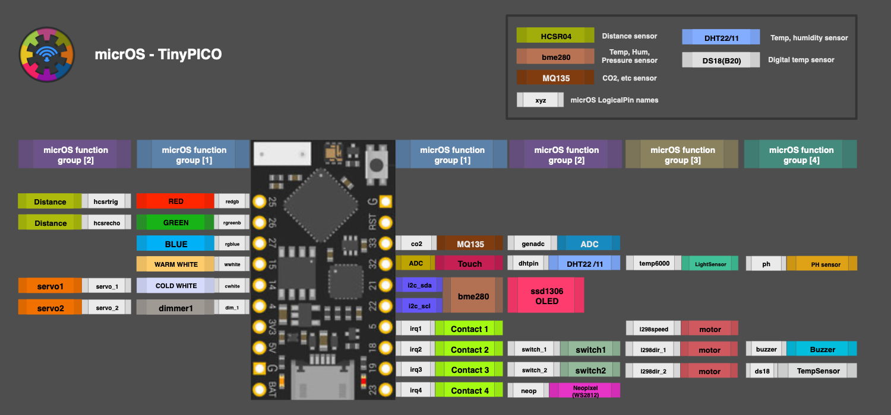
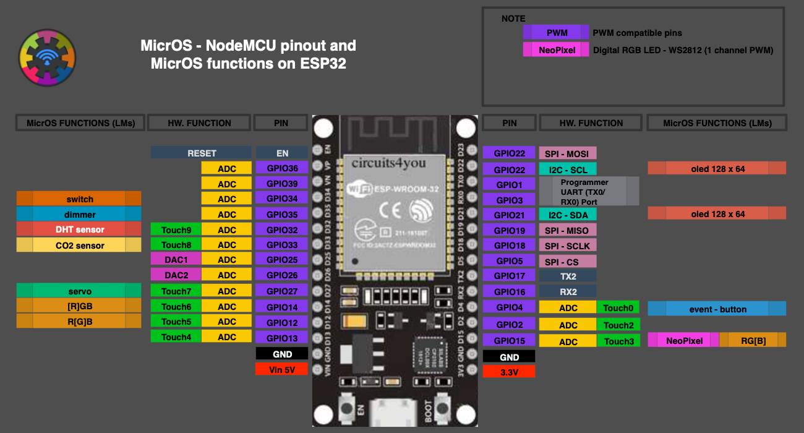
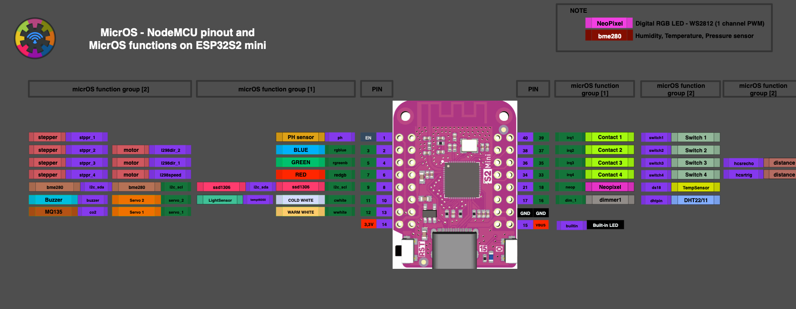
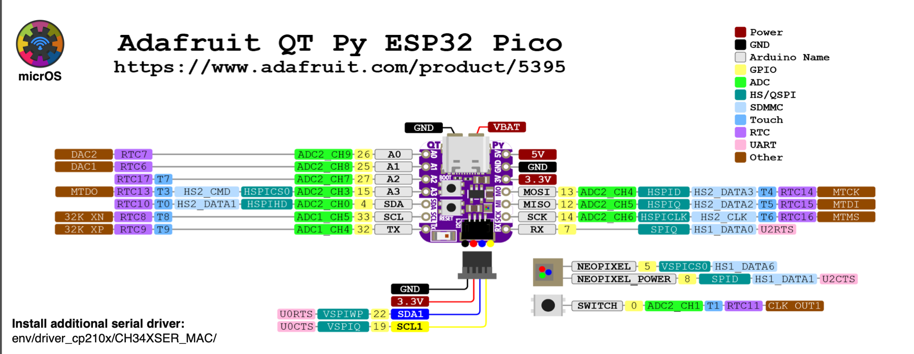

# Hardware, memory, and pin-map guide

This page contains the detailed hardware guidance previously embedded in the
project README. Start with the [firmware catalog](../micrOS/micropython/README.md)
to confirm that a suitable image and deployment path exist for a board.

## Capabilities and example boards

micrOS provides an asynchronous task manager, configuration manager, cron and
event interrupts, REST and socket-shell interfaces, a generated web UI, GPIO
and I2C support, RTC/NTP integration, STA/AP Wi-Fi, OTA updates, and InterCon
over sockets or ESP-NOW.

Included mappings and project examples cover ESP32, ESP32-S2, ESP32-S3,
ESP32-C3, ESP32-C6, TinyPICO, ESP32-CAM OV2640, QT Py ESP32, M5Stamp, and
RP2/Pico W-class boards. Some historical or port-specific targets have reduced
functionality. A pin map alone does not guarantee compatibility: deployment
method, firmware image, peripheral drivers, and memory availability vary by
MicroPython port.

<strong>Capability and example-board badges</strong>

## Memory guidance

Enabling more than approximately two Load Modules together with the full web
UI generally requires more than **150–200 KB** of available RAM.

For larger applications, choose a board with **2, 4, or 8 MB of additional
PSRAM**. It may be described as PSRAM, SPIRAM, or octal PSRAM. Check the actual
board specification before buying; the selected MicroPython build must support
the installed memory.

Examples of higher-memory hardware:

- **`esp32s3`**: A fast Espressif MCU with PSRAM detection. Typical
  configurations include 2 MB for general use and 4–8 MB for image processing,
  audio, and larger combinations of GPIO applications.
- **`esp32s3-octo`**: Uses an eight-bit PSRAM interface for higher throughput.
- **`tinypico`**: Compact hardware commonly supplied with 4 MB of PSRAM, at a
  higher price than basic ESP32 boards.
- **`esp32cam`**: Uses a camera-capable image. Historical project notes describe
  an 8 MB configuration; this is not a guarantee for every product sold under
  the ESP32-CAM name.

The following are historical project measurements and estimates, not limits
enforced by the runtime:

- The original guide estimated roughly 250 KB for a fuller setup and
  recommended 2–8 MB PSRAM configurations.
- A heavily loaded 4 MB system used approximately 230 KB (5.6%), including
  `oled_ui` and several other modules.
- Camera streaming can consume approximately 2 MB, or 50% of a 4 MB
  configuration.
- The original guide reported instability near 80% heap use in some setups.
  Allocation size and fragmentation matter too, so this is not a universal
  threshold.

A standard ESP32 can still work well with ShellCli and without WebCli. Web
assets and multiple asynchronous tasks each consume additional memory, making
a spare ESP32 suitable for exploring a smaller feature set.

## Built-in peripheral support

Sensors, inputs, actuators, and outputs are documented in the generated
[Load Module catalog](https://htmlpreview.github.io/?https://github.com/BxNxM/micrOS/blob/master/micrOS/client/sfuncman/sfuncman.html).
Module availability and wiring requirements depend on the deployed firmware and
board.

## Logical pin association

`microIO` resolves logical pins through `modules/IO_*.py` board maps. Use an
existing map such as `IO_esp32.py` as a template for `IO_<name>.py`, then set
`cstmpmap` to `<name>`. Individual logical pins can be overridden too:
`neop:25` maps the logical NeoPixel pin to GPIO 25. Inspect the active mapping
with `system pinmap` or an application's `pinmap()` function.

Implementation: [`micrOS/source/microIO.py`](../micrOS/source/microIO.py)

Included logical-pin lookup tables:

- [TinyPICO](../micrOS/source/modules/IO_tinypico.py)
- [ESP32](../micrOS/source/modules/IO_esp32.py)
- [ESP32-S2](../micrOS/source/modules/IO_esp32s2.py)
- [ESP32-S3](../micrOS/source/modules/IO_esp32s3.py)
- [M5Stamp](../micrOS/source/modules/IO_m5stamp.py)
- [QT Py](../micrOS/source/modules/IO_qtpy.py)
- [Raspberry Pi Pico W / RP2](../micrOS/source/modules/IO_rp2.py) — a reset is
  required after an OTA update because of a WebREPL limitation
- [`IO_*.py` and other mappings](../micrOS/source/modules/)

Use constant variables for pin-map declarations. These source files are
automatically precompiled into `.mpy` bytecode for deployment.

## Wiring illustrations

[General microPLC controller concept](../media/microPLC.png)

