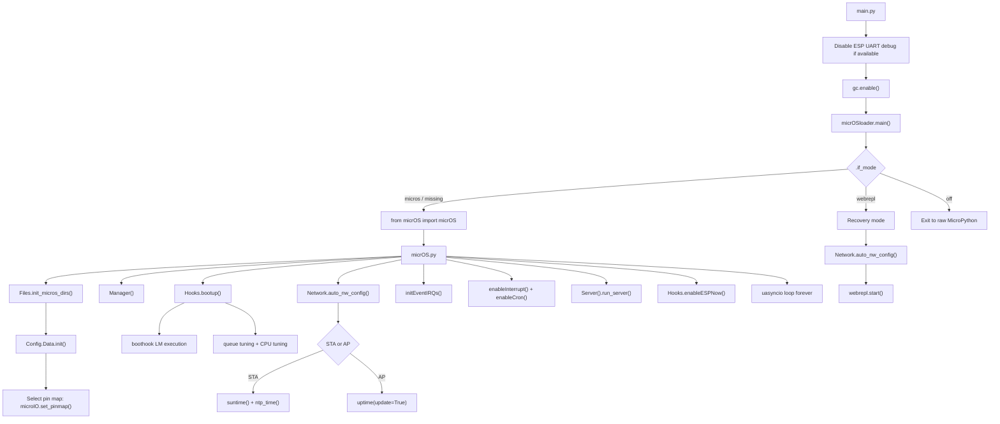
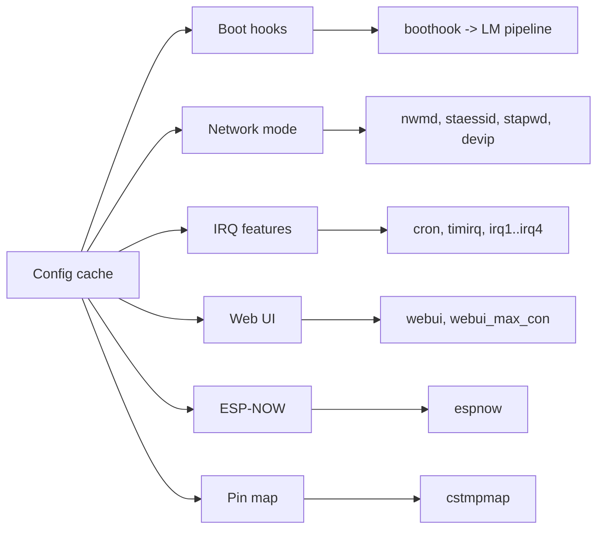
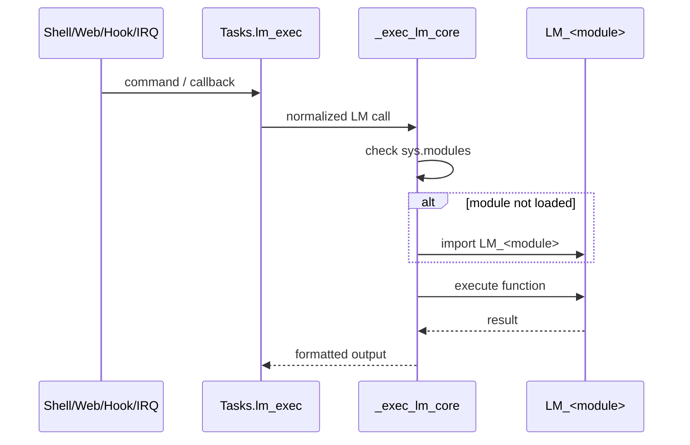
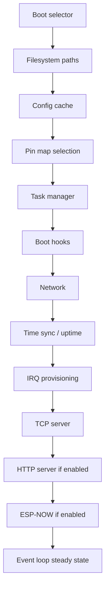
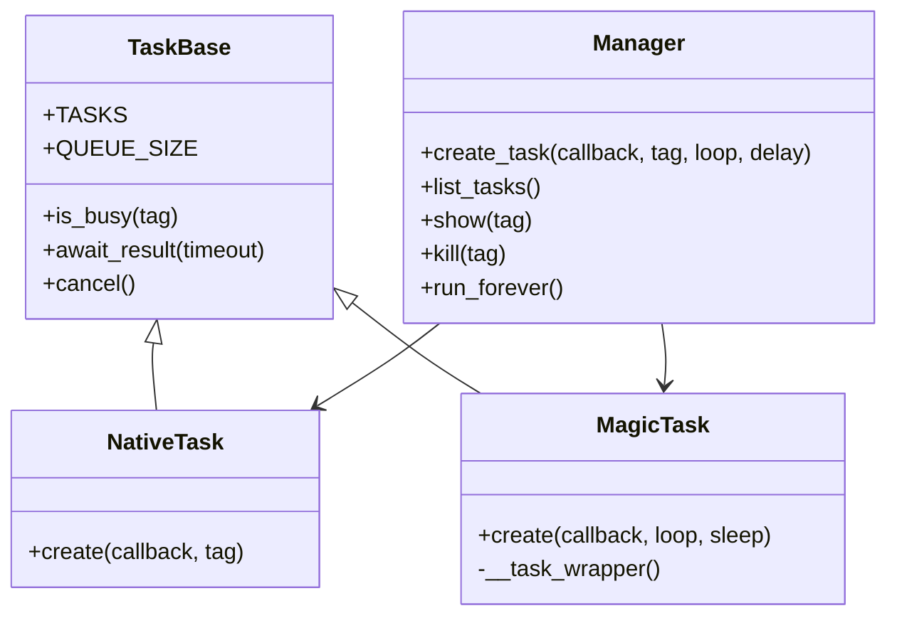
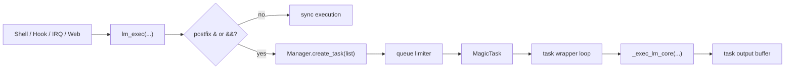

# micrOS Architecture

**Heigh level architecture**

## Purpose

This document summarizes the `micrOS/source` root architecture from three angles:

- boot flow at file level
- feature activation at runtime
- lazy loading and memory control driven by configuration

## Architectural View

micrOS is a small resident MicroPython core with:

- a boot selector and recovery path
- a config-driven runtime initializer
- an async task and command execution layer
- optional features enabled by config and loaded only when needed

The design is intentionally biased toward small boot footprint, deferred feature activation, and stateful load modules.

## Boot Flow

### File-level boot sequence

### Boot responsibilities by file

| File | Responsibility |
| --- | --- |
| `main.py` | Minimal board bootstrap, GC enable, handoff to loader |
| `micrOSloader.py` | Select normal mode vs recovery mode based on `.if_mode` |
| `micrOS.py` | Assemble the runtime: config, hooks, network, IRQs, server, event loop |
| `Files.py` | Root directory validation and module/lib path exposure |
| `Config.py` | Normalize persisted config, inject defaults, initialize pinmap and debug mode |
| `Hooks.py` | Boot hooks, queue tuning, CPU tuning, boot profiling, optional ESP-NOW startup |
| `Network.py` | STA/AP bring-up and runtime identity updates |
| `Interrupts.py` | Timer IRQ, cron IRQ, and external event IRQ provisioning |
| `Server.py` | Socket shell server and optional HTTP server |
| `Tasks.py` | LM command execution and async task orchestration |

## Feature Activation Model

The runtime is configuration-first. Core code is present at boot, but several features activate only when their configuration path is enabled.

### Main feature toggles

| Config key(s) | Runtime effect |
| --- | --- |
| `boothook` | Executes LM commands during boot |
| `nwmd`, `staessid`, `stapwd` | Selects and configures network mode |
| `cron`, `crontasks` | Enables scheduler import and cron timer |
| `timirq`, `timirqcbf`, `timirqseq` | Enables periodic timer callback execution |
| `irq1..irq4`, `irq*_cbf`, `irq*_trig` | Enables external event interrupts |
| `webui`, `webui_max_con` | Enables HTTP server and bounds web memory usage |
| `espnow` | Enables ESP-NOW server path |
| `cstmpmap` | Selects board pin map and overrides |
| `boostmd` | Sets CPU frequency policy |
| `aioqueue` | Governs LM task queue and affects pool sizing |

## Lazy Loading Strategy

micrOS uses practical lazy loading, not aggressive eviction.

### Core idea

The mandatory runtime stays resident, while optional subsystems and feature modules are loaded only when configuration or command flow requires them.

### Load module path

### What is lazy-loaded

- `LM_*` modules are imported on first execution from `Tasks._exec_lm_core(...)`
- `Scheduler` is imported only when `cron` is enabled
- `Web.WebEngine` is imported only when `webui` is enabled
- `Espnow.ESPNowSS` is imported only when `espnow` is enabled
- `IO_*` board maps are imported only when a pin must be resolved

### Optionally loaded modules

The following modules or module families are not part of the mandatory default boot footprint and load only when their feature path is activated:

| Module | Load condition | Trigger file |
| --- | --- | --- |
| `LM_*` | First command / hook / IRQ / REST execution | `Tasks.py` |
| `Scheduler` | `cron = true` | `Interrupts.py` |
| `Web.WebEngine` | `webui = true` | `Server.py` |
| `Espnow.ESPNowSS` | `espnow = true` | `Hooks.py`, `InterConnect.py` |
| `IO_*` | First physical pin resolution | `microIO.py` |
| `Time.ntp_time`, `Time.suntime` | STA mode only | `micrOS.py` |
| `Time.uptime` | AP / non-STA path | `micrOS.py` |
| `micropython.mem_info` | `dbg = true` and profiling call | `Hooks.py` |
| `machine.reset_cause` constants | Boot-cause evaluation | `Hooks.py` |
| `microIO.detect_platform` | CPU tuning path | `Hooks.py` |

### What remains resident

- core runtime files used to assemble the system
- loaded stateful `LM_*` modules after successful import
- task manager, network stack, socket server, and active feature services

This is important: module retention is part of the design, because many LMs own persistent hardware state, registered endpoints, cached device objects, or long-running tasks.

## Resource Load Order

## Task Management

Task management is centralized in `Tasks.py` and built around one singleton manager plus two execution modes:

- `NativeTask`: for coroutine-based system services such as the idle task, socket server, and other native async jobs
- `MagicTask`: for LM command execution wrapped into async background jobs
- `Manager`: the single orchestration entry point for creation, queue limiting, task listing, output inspection, and cancellation

### Operational model

- `Manager()` starts the permanent `idle` task once
- native tasks are not queue-limited
- LM background tasks are queue-limited through `aioqueue`
- LM task IDs use `module.function`, which keeps task control aligned with command semantics
- passive task entries are trimmed by `TaskBase._task_gc()` to avoid unbounded task-cache growth

### Task execution UML

### LM background execution flow

## Memory Control

micrOS uses a few direct resource controls instead of a general-purpose memory manager:

- deferred `LM_*` imports through `sys.modules`
- config-gated imports for optional subsystems
- bounded passive task cache in `TaskBase._task_gc()`
- memory-sized web receive/send pools in `Web.Buffer.init_pools()`
- offloaded config values via `Config.disk_keys()`
- queue and CPU tuning during boot via `Hooks`

## Architectural Notes

### Strengths

- Clear separation between boot selection, runtime assembly, and feature execution
- Good fit for MicroPython constraints: small core plus deferred feature activation
- Load-module model keeps feature code out of the mandatory boot path
- Configuration acts as the primary orchestration surface

### Current realities

- LM loading is lazy, but LM eviction is intentionally not aggressive
- Core boot/runtime assembly remains eager for stability
- Dynamic `exec(...)` and `eval(...)` are still part of the command and pin-resolution model
- External IRQ emergency buffering now correctly follows `irq1..irq4` enable state

## Summary

micrOS is architected as a compact runtime kernel around:

- loader
- config
- task manager
- network/server stack
- optional stateful load modules

It is not plugin-managed in the desktop sense. It is a config-driven embedded runtime where features are activated late, stay resident when stateful, and are bounded by simple but effective resource policies.
