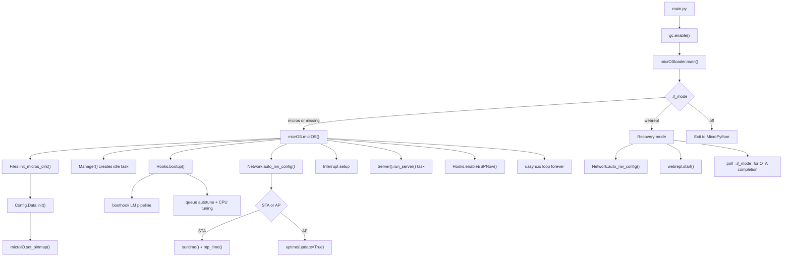
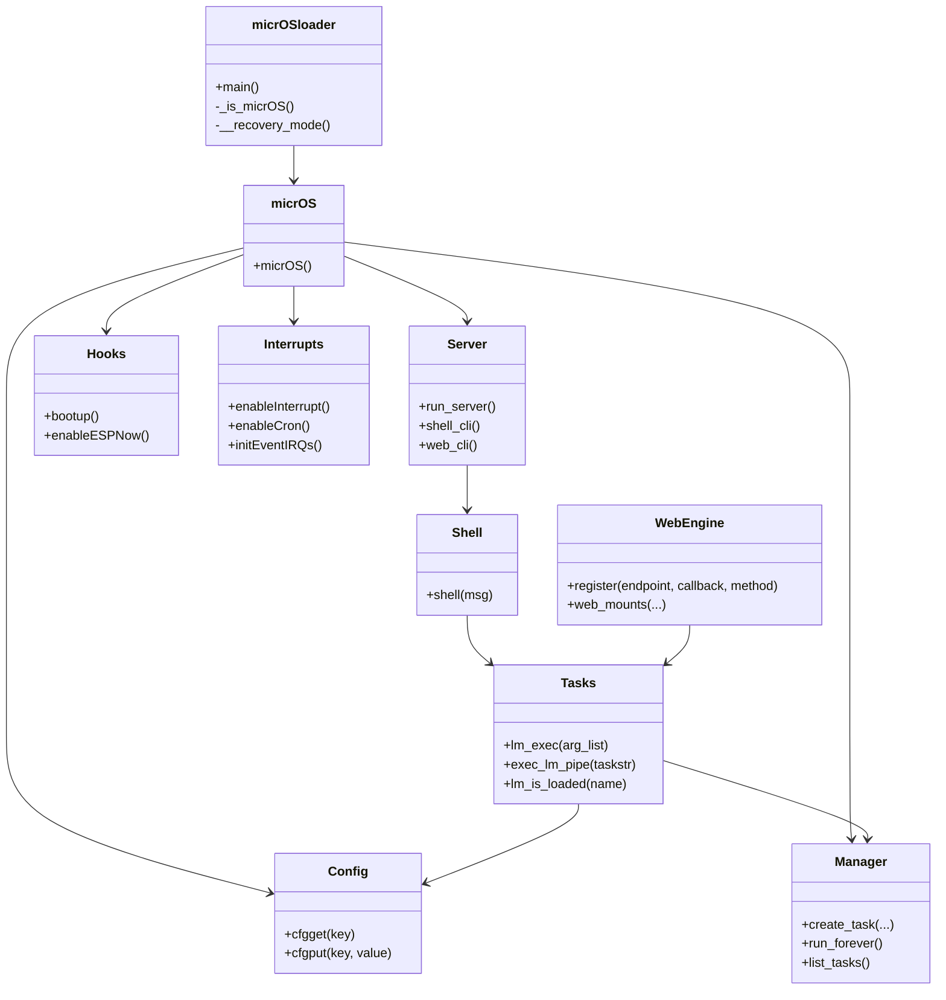

# micrOS System Architecture

## Scope

This document reviews the `micrOS/source` root architecture with emphasis on:

- how boot and runtime behavior are driven by configuration parameters
- how load modules are brought in on demand
- how the system reduces memory pressure through lazy loading and bounded resource pools

## High-Level Boot Path

## Configuration-Driven Runtime

The system is config-first. `Config.py` initializes `Data.CONFIG_CACHE`, merges persisted `config/node_config.json`, applies defaults, migrates obsolete keys, and writes the normalized result back. Most subsystems read configuration through `cfgget(...)`, so boot behavior is mostly data-driven rather than hard-coded.

### Important config keys and their effects

| Config key | Effect |
| --- | --- |
| `nwmd` | Selects preferred network mode. `STA` tries Wi-Fi client first, otherwise AP fallback. |
| `staessid`, `stapwd` | STA connection candidates, including `;`-separated multi-network fallback. |
| `devfid`, `appwd`, `auth` | Device identity, shell/web credentials, and shell/web authorization behavior. |
| `boothook` | Executes a semicolon-separated LM command pipeline during boot via `Hooks.bootup()`. |
| `aioqueue` | Maximum LM task queue size and one of the inputs for web connection limits. |
| `boostmd` | Switches CPU frequency between low-power and boosted mode in `Hooks._tune_performance()`. |
| `webui`, `webui_max_con` | Enables HTTP server and bounds web memory usage / connection count. |
| `cron`, `crontasks` | Enables scheduler import and timer-driven cron execution. |
| `timirq`, `timirqcbf`, `timirqseq` | Enables timer IRQ and LM callback execution on period. |
| `irq1..irq4`, `irq*_cbf`, `irq*_trig`, `irq_prell_ms` | Enables and configures external GPIO interrupts. |
| `cstmpmap` | Selects a board IO map and optional custom pin overrides. |
| `espnow` | Enables ESP-NOW server and ESP-NOW-based inter-device transport. |
| `guimeta` | Marked as offloaded; stored outside the in-memory config cache body. |

## Runtime Component Model

## How Load Modules Are Loaded

Load modules are the primary lazy-loading mechanism.

### Execution path

1. A shell command, web REST call, boot hook, IRQ callback, or scheduled task eventually reaches `Tasks.lm_exec(...)`.
2. `_exec_lm_core(...)` converts the requested module name into `LM_<name>`.
3. The module is imported only if it is not already present in `sys.modules`.
4. The requested function is executed dynamically.
5. If a memory allocation failure occurs, the module is removed from `sys.modules` and `gc.collect()` is triggered.

### Consequence

This means most application features do not occupy RAM at boot. They become resident only after first use, and many LM files expose a `load()` function to perform one-time hardware or endpoint initialization only when explicitly requested.

## Memory Optimization Mechanisms

### 1. Demand-loaded load modules

`Tasks._exec_lm_core(...)` imports `LM_*` modules only when a command needs them. This is the core lazy-loading strategy.

### 2. Conditional imports for optional subsystems

The source tree repeatedly avoids eager imports:

- `Server.py` imports `Web.WebEngine` only when `webui` is enabled; otherwise it uses a tiny compatibility stub.
- `Interrupts.py` imports `Scheduler.scheduler` only when `cron` is enabled.
- `Hooks.enableESPNow()` imports `Espnow.ESPNowSS` only when `espnow` is enabled.
- `InterConnect.py` resolves ESP-NOW support only when enabled.
- `Network.py` applies ESP-NOW specific Wi-Fi power settings only when needed.
- `microIO.py` imports the selected `IO_*` board map dynamically when a pin is resolved.

### 3. Bounded async task retention

`TaskBase._task_gc()` trims inactive tasks once the passive cache exceeds `aioqueue`. This prevents unlimited historical task object accumulation.

### 4. Memory-aware web buffer pools

`Web.Buffer.init_pools()` sizes receive/send pools from current free heap and clamps connection count with:

- `aioqueue`
- `webui_max_con`
- measured free memory

This is one of the strongest explicit memory controls in the system.

### 5. Offloaded config values

`Config.disk_keys()` keeps selected large string values outside the normal in-memory cache. The current default example is `guimeta`.

### 6. Runtime tuning from available RAM

`Hooks._tune_queue_size()` estimates a suitable queue size from `gc.mem_free()` and raises `aioqueue` when memory allows it.

## Boot-Time vs On-Demand Loading

| Area | Boot-time behavior | On-demand behavior |
| --- | --- | --- |
| Core filesystem | Always initialized | N/A |
| Config cache | Always loaded | Offloaded keys read lazily |
| Pin map selection | Selected at config init | Actual `IO_*` map imported when pin is resolved |
| Async manager | Always created | LM tasks created only when commands require them |
| Shell TCP server | Always started | Session work happens per client |
| Web server | Only if `webui=true` | Endpoints and buffers used per connection |
| Scheduler | Only if `cron=true` | Callback execution happens on timer ticks |
| ESP-NOW | Only if `espnow=true` | Traffic handling begins after server start |
| Load modules | Not preloaded by default | Imported at first command / hook / IRQ use |

## Architecture Review Notes

### What is good

- The system keeps the mandatory resident core relatively small.
- Optional subsystems are commonly protected by config-gated imports.
- LM execution through `sys.modules` gives a practical lazy-loading model for MicroPython.
- Web memory usage is explicitly bounded instead of being purely reactive.
- The boot hook mechanism allows feature activation without changing core boot code.

### Important caveats

- `Tasks._exec_lm_core(...)` imports modules lazily, but it does not actively unload them after successful use. Memory is optimized for startup and first-use deferral, not for aggressive post-use eviction.
- `micrOS.py` imports several core modules eagerly at module scope. That is fine for stability, but it means the core runtime footprint is fixed once main mode starts.
- `Interrupts.emergency_mbuff()` checks `cfgget('extirq')`, but the config schema exposes `irq1..irq4` instead of an `extirq` flag. That means emergency buffer allocation may not reflect external IRQ usage correctly.
- Dynamic execution uses `exec(...)` and `eval(...)` in `Tasks.py` and `microIO.py`. This is flexible and compact, but harder to statically analyze and easier to break with naming inconsistencies.

## Practical Interpretation

micrOS is not using a separate dependency injector or plugin manager. Its effective architecture is:

- a small always-on core
- config-controlled subsystem activation
- on-demand LM imports
- bounded async and web resource pools

That combination is a valid lazy-loading strategy for constrained MicroPython targets, especially because the most feature-heavy logic lives in `LM_*` modules instead of the boot-critical core.
