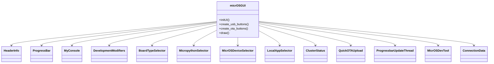
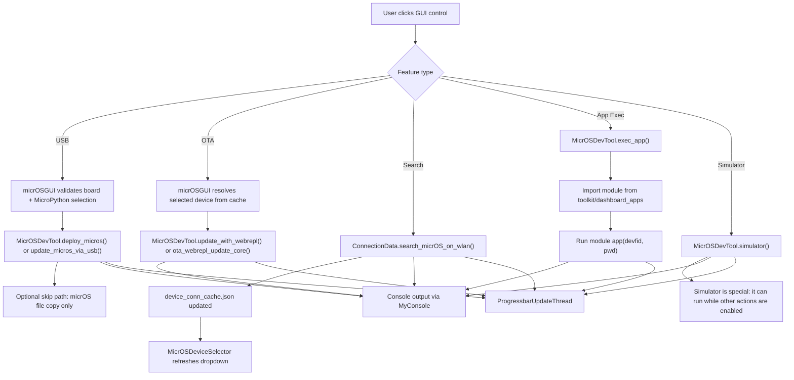
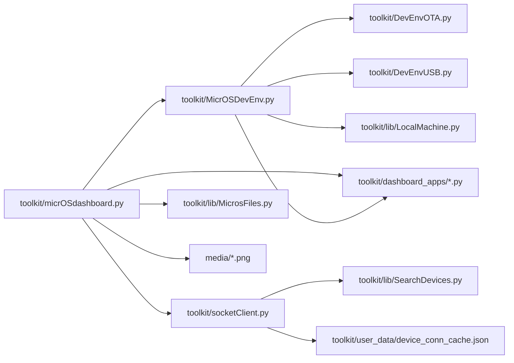

# micrOS Dashboard GUI Architecture

## Scope

This document describes the high-level GUI architecture of `toolkit/micrOSdashboard.py`, with emphasis on:

- user-facing feature groups
- runtime control flow
- invoked file dependencies
- extension points for local dashboard apps

It is intentionally feature-oriented rather than class-by-class exhaustive.

## High-Level Features

- USB deployment and update
  - select board type
  - select matching MicroPython binary
  - optionally skip erase + MicroPython flashing and copy micrOS files only
  - deploy a fresh device
  - update an existing USB-connected device
- OTA operations
  - select a cached micrOS node
  - provide OTA password
  - full OTA update
  - load-module-only OTA update
  - quick drag-and-drop OTA upload
  - WLAN device discovery
- Local simulator
  - start micrOS on the host machine
  - stop the simulated runtime
- Dashboard app execution
  - choose a local app module from `toolkit/dashboard_apps/`
  - run the app against the selected micrOS node
- Status and feedback
  - console output
  - progress bar
  - node status query
  - job completion monitoring
  - busy-state feedback for protected real operations

## Component View

## Runtime Flow

## File Dependency Map

### Primary entrypoint

- `toolkit/micrOSdashboard.py`
  - owns the Qt widget tree
  - coordinates user actions
  - starts background jobs
  - renders progress and console feedback

### Directly invoked service files

- `toolkit/MicrOSDevEnv.py`
  - GUI-facing service facade
  - bridges GUI actions to OTA, USB, simulator, and dashboard app execution
- `toolkit/DevEnvOTA.py`
  - OTA update orchestration
  - version checks, password handling, WebREPL upload flow
- `toolkit/DevEnvUSB.py`
  - USB deploy/update orchestration
  - MicroPython flashing and micrOS upload
  - optional copy-only USB path when `Skip micropython` is enabled
- `toolkit/socketClient.py`
  - cached device discovery
  - device selection
  - status queries and network calls

### Shared helper files

- `toolkit/lib/LocalMachine.py`
  - file operations and local environment helpers
- `toolkit/lib/MicrosFiles.py`
  - drag-and-drop upload file extension validation
- `toolkit/lib/SearchDevices.py`
  - network scan support used by `socketClient.py`

### User-extensible app surface

- `toolkit/dashboard_apps/*.py`
  - local dashboard app modules dynamically selected by the GUI
  - each executable module is expected to expose `app(...)`
- `toolkit/dashboard_apps/_app_base.py`
  - common patterns for dashboard app implementations

### Data files touched by the GUI flow

- `toolkit/user_data/device_conn_cache.json`
  - cached micrOS device list
- `media/*.png`
  - GUI icons and branding assets

## Dependency Graph

## Notes For Maintenance

- The dashboard is now safest when treated as a protected single-job controller for real operations.
- `simulator` is the explicit exception: it can run in parallel with other features.
- `Skip micropython` changes USB deploy/update semantics from flash+copy to copy-only.
- For real maintenance workflows, deploy+skip should be treated as a convenience path for already-prepared devices, not as a true empty-board provisioning flow.
- `MicrOSDevTool` is the main orchestration boundary between Qt and deployment logic.
- `toolkit/dashboard_apps/` is the cleanest area for feature growth without expanding the main GUI file.
- If the GUI grows further, the next sensible split is:
  - widget/view layer in `micrOSdashboard.py`
  - job controller layer in a separate file
  - per-feature action handlers in separate modules
